## Toronto Flag Queens 2019

**Event name:** Day of Shecurity Toronto 2019  
**Location:** George Brown College  
**Date:** 14/09/2019 - 18/09/2019  
**Team**: BoT

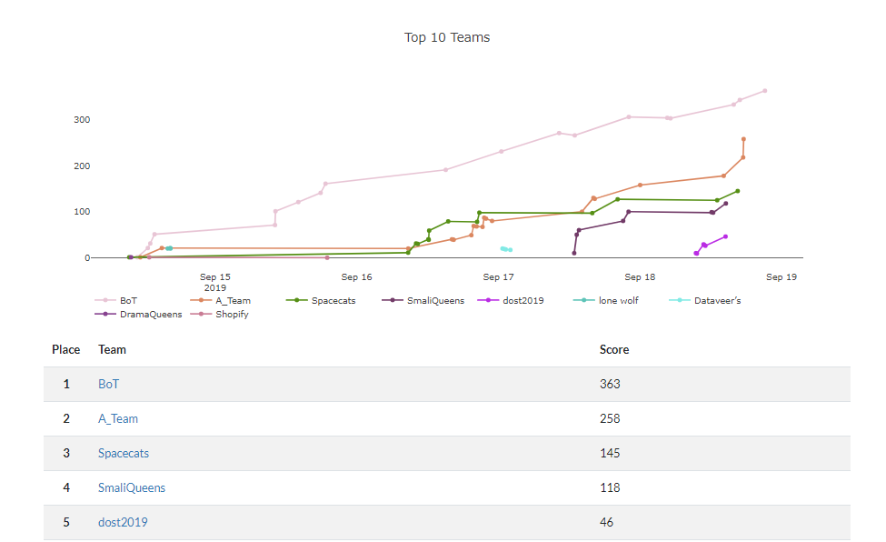

### [Flag Queen] Veni, vidi, vici

Upon registration, all participants receive a card that looks like this.


The line at the bottom looks weird but `://` and `.klm/` was a dead giveaway that it was a URL link. `ROT13 cipher` easily reveal `uggcf://qnlbsfurphevgl.klm` to be `https://dayofshecurity.xyz`

#### Alternatives by [Lookout](https://dayofshecurity.xyz/writeups/vvv):

The most obvious way to solve this puzzle is a "known cleartext" approach. Since punctuation characters were not "encrypted" -  Caesar Cipher would hardly qualify as such by today's standards - the challenge is immediately recognizable as a URL. Seeing the two `g` in the challenge representing `t` in `https` points at a simple substitution cipher. If we write down the alphabet with known substitutions we get:

```
abcdefghijklmnopqrstuvwxyz
  p  st             h
```

It is not a great leap from here to recognize that the letters in the bottom row are not only in alphabetical order (with rolling over from `z` to `a`) but also at the correct distance from one another to constitute the alphabet shifted by 13 positions. 13 is a special case as it makes the encryption function its own decryption. We could use Python to solve this:

```
"".join( [ chr((ord(c)-ord('a')+13)%26+ord('a')) if c>='a' and c<='z' else c for c in "uggcf://qnlbsfurphevgl.klm/" ] )
'https://dayofshecurity.xyz/'
```

**Flag: https://dayofshecurity.xyz**


---


### [Web] Oh, yes. Little Bobby Tables we call him

> The backend devs of this Super Secure Site (TM) thought they'd protected their users' personal data. But, they've missed some things.
>
> First you find the data, then you get the points, then you get the power.
>
> https://chmodxx.net/dos

With the challenge named [Little Bobby](https://xkcd.com/327/), there was little to no doubt that this challenge requires some form of SQL injection. With that in mind, I did a quick survey on the website in general. It only consist of a normal login page with some form of validation being enforced. Poking around, I noticed that any attempt to submit data from the frontend would have their data sanitized with the `serialize()` command.


Nevertheless, I tried the usual SQL injection statement to see if the login form is vulnerable. Lo and behold, it is. Now that I know that the site vulnerable from the frontend attack vector, I proceed to check the backend too.

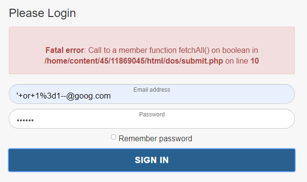

Copying the request I made from the `Network` panel as a `curl` request, I tried submitting `'1 or 1=1--` as the injection statement. Nope, that didn't work out -- I got the same fatal error as above. When I changed the injection statement to `' or 1=1--` though, I got something different, which unfortunately, is not the flag. _Whyyyyy?_

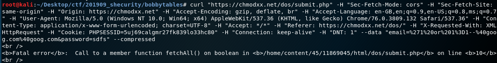


The answer lies in how the `curl` request was constructed. The `curl` I used contains a `Cookie` value specific to the browser session hence even if the injection were successful, I wouldn't have been able to see anything within the terminal. I actually needed to go back to my browser that _hasn't been closed_ and _refresh_ the page to see the flag!

```
curl "https://chmodxx.net/dos/submit.php"
	[TRUNCATED]
-H "Cookie: PHPSESSID=5uj69calgmr27fk839lo33hc80" -H "Connection: keep-alive" -H "DNT: 1" --data "email=%27%20or%201%3D1--&password=sadfsdf" --compressed
```

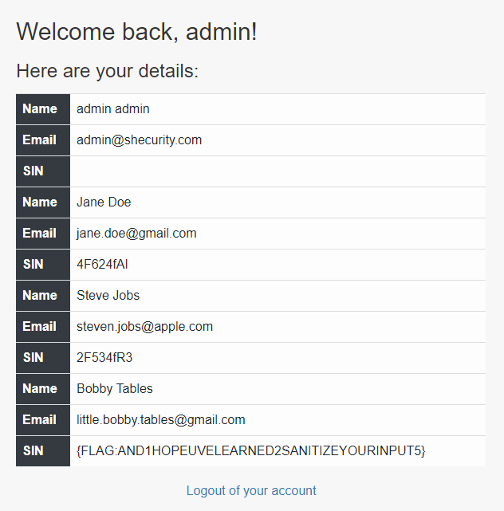

**Flag: {FLAG:AND1HOPEUVELEARNED2SANITIZEYOURINPUT5}**


---

### [Reverse Engineering] Call the Doctor

> The binary needs some work to make it spit out the flag
>
> [ flag.exe](./source/callthedoctor.exe)


#### Alternatives by [Lookout](https://dayofshecurity.xyz/writeups/doctor):

We are given an `EXE` file that when run simply prints "Key is wrong" and exits. When we do `file flag.exe` we can see it's an x86 executable `flag.exe: PE32 executable (console) Intel 80386, for MS Windows`. We need to open this file in a disassembler to get a better picture. When doing so we will see:

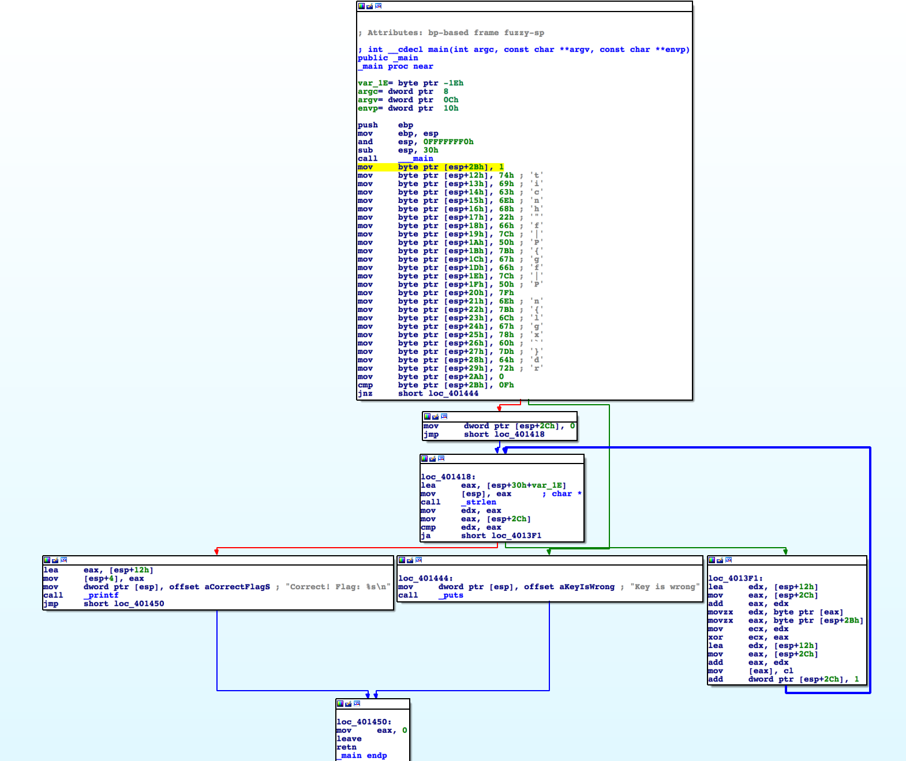

Looking at this disassembly we can see a jump of interest:

```
mov     byte ptr [esp+2Bh], 1
[...]
cmp     byte ptr [esp+2Bh], 0Fh
jnz     short loc_401444
```

We compare `[esp+2Bh]` to `0xF` and if they do not match we jump to a branch that prints "Key is wrong" and exits. Since we are setting this address to be `0x1`, the comparison will never match and we will always jump to the same branch. The other branch is where we want to be.

One way to ensure we arrive at the other branch is to patch the binary to perform a `Jump If Zero (jz)` instead of doing a `Jump If Not Zero (jnz)`. To accomplish this we would have to change the instruction from `jnz (0x75)` to `jz (0x74)` -- refer [this](http://faydoc.tripod.com/cpu/jnz.htm) for more information on these codes.

However this will not lead to the flag. If we look on the right side of the disassembly we can see that `[esp+2Bh]` is being used in some sort of loop that includes xor instructions. We may have arrived at the right branch but we are trying to xor decrypt the flag using the incorrect value. Instead we need to arrive at the branch with the proper value in `[esp+2Bh]`. Since the program checks for this value to be `0xF` we can patch the program to set the variable to 0xF, `mov byte ptr [esp+2Bh], 0Fh`.

After applying this patch and running the patched `EXE` we get the output we wanted: `Correct! Flag: {flag-is_this_patchwork}\n`

**Flag: {flag-is_this_patchwork}**


---


### [Reverse Engineering] Not the Up eXpress

> Hackers must see underneath the underneath...
>
> [ doesThisAddUp.exe](./source/upexpress.exe)


#### Alternatives by [Lookup](https://dayofshecurity.xyz/writeups/upx):

The challenge presents a PE to download and no further clues apart from the title.
The title capitalizes "UP" and "X" and suggests this challenge doesn't have anything to do with Toronto's nicest train.

As usual when dealing with files from a CTF, we first check out what the file is with the `file` utility:

```
$ file doesThisAddUp.exe 
doesThisAddUp.exe: PE32 executable (console) Intel 80386, for MS Windows, UPX compressed
```

This tells us the file is a Windows executable and is also "UPX compressed" which matches with what is already hinted at by the title.

UPX is an open-source "[packer](https://en.wikipedia.org/wiki/UPX)". Packers are utilities that can compress and/or obfuscate another program in such a way that the original program is functionally equivalent but the actual bytes of the program are different. Therefore, to see the original program we must first unpack it from the executable we downloaded. After installing the freely available UPX utilities:

```
upx -d doesThisAdUp.exe -o /tmp/original.exe
                       Ultimate Packer for eXecutables
                          Copyright (C) 1996 - 2018
UPX 3.95        Markus Oberhumer, Laszlo Molnar & John Reiser   Aug 26th 2018

        File size         Ratio      Format      Name
   --------------------   ------   -----------   -----------
upx: mod: CantUnpackException: header corrupted 3

Unpacked 0 files.
```

That didn't work! The utility gave up seemingly due to a corrupt header, `header corrupted 3`. UPX is open source, so we can get its source code and narrow down exactly which conditions would cause such an error.

```
upx-3.95-src/src/packhead.cpp-
upx-3.95-src/src/packhead.cpp-    // check header_checksum
upx-3.95-src/src/packhead.cpp-    if (version > 9)
upx-3.95-src/src/packhead.cpp-        if (p[size - 1] != get_packheader_checksum(p, size - 1))
upx-3.95-src/src/packhead.cpp:            throwCantUnpack("header corrupted 3");
upx-3.95-src/src/packhead.cpp-
upx-3.95-src/src/packhead.cpp-    if (c_len < 2 || u_len < 2 || !mem_size_valid_bytes(c_len) || !mem_size_valid_bytes(u_len))
upx-3.95-src/src/packhead.cpp-        throwCantUnpack("header corrupted 4");
upx-3.95-src/src/packhead.cpp-    //
```

Our error looks like it's caused by a bad `packheader_checksum`.

We now have a couple options for how to proceed. We can examine the code to learn how the checksum is calculated and repair the file, or we can modify the source code to ignore this checksum error. The latter approach seems fastest.

```
$ grep -RC 4 "header corrupted 3"

upx-3.95-src/src/packhead.cpp-
upx-3.95-src/src/packhead.cpp-    // check header_checksum
upx-3.95-src/src/packhead.cpp-//  if (version > 9) {}
upx-3.95-src/src/packhead.cpp-//        if (p[size - 1] != get_packheader_checksum(p, size - 1))
upx-3.95-src/src/packhead.cpp://            throwCantUnpack("header corrupted 3");
upx-3.95-src/src/packhead.cpp-
upx-3.95-src/src/packhead.cpp-    if (c_len < 2 || u_len < 2 || !mem_size_valid_bytes(c_len) || !mem_size_valid_bytes(u_len))
upx-3.95-src/src/packhead.cpp-        throwCantUnpack("header corrupted 4");
upx-3.95-src/src/packhead.cpp-    //
```

The `if` lines and the exception are all commented out. Let's compile the utility and see what we get!

```
upx-3.95-src $ ./src/upx.out -d /tmp/doesThisAddUp.exe -o /tmp/original.exe
                       Ultimate Packer for eXecutables
                          Copyright (C) 1996 - 2018
UPX 3.95        Markus Oberhumer, Laszlo Molnar & John Reiser   Aug 26th 2018

        File size         Ratio      Format      Name
   --------------------   ------   -----------   -----------
upx.out: /tmp/mod: Exception: checksum error

Unpacked 1 file: 0 ok, 1 error.

$ file /tmp/original.exe
/tmp/original.exe: cannot open `/tmp/original.exe' (No such file or directory)
```

Almost! We have a different error message now, but it seems like it's at least getting close. Although the output claims to have "Unpacked 1 file" the error still prevents it from being written to disk. Let's repeat our previous code editing with our new error message:

```
$ grep -RC 4 "checksum error"
--
upx-3.95-src/src/except.cpp-}
upx-3.95-src/src/except.cpp-
upx-3.95-src/src/except.cpp-void throwChecksumError()
upx-3.95-src/src/except.cpp-{
upx-3.95-src/src/except.cpp:    throw Exception("checksum error");
upx-3.95-src/src/except.cpp-}
upx-3.95-src/src/except.cpp-
upx-3.95-src/src/except.cpp-void throwCompressedDataViolation()
upx-3.95-src/src/except.cpp-{
This requires a little more digging since we've found a function that throws the exception rather than the exact spot the exception is thrown.

$ grep -Rl throwChecksumError | grep -v "\.o"
upx-3.95-src/src/except.cpp
upx-3.95-src/src/p_lx_elf.cpp
upx-3.95-src/src/p_unix.cpp
upx-3.95-src/src/packer.cpp
upx-3.95-src/src/p_lx_interp.cpp
upx-3.95-src/src/except.h
```

The `.o` files are leftovers from the compilation process so we can ignore those results.
As we are dealing with a Windows PE file, we can ignore the unix and elf results as well. This leaves us with `packer.cpp`:

```
$ grep -RC4 throwChecksumError upx-3.95-src/src/packer.cpp 
    if (verify_checksum)
    {
        adler = upx_adler32(in, ph.c_len, ph.saved_c_adler);
        if (adler != ph.c_adler)
            throwChecksumError();
    }

    // decompress
    if (ph.u_len < ph.c_len) {
--
        if (ft)
            ft->unfilter(out, ph.u_len);
        adler = upx_adler32(out, ph.u_len, ph.saved_u_adler);
        if (adler != ph.u_adler)
            throwChecksumError();
    }
}
```

There are two places that need a little editing before we can try to recompile and decompress:

```
$ grep -RC4 throwChecksumError upx-3.95-src/src/packer.cpp 
    if (verify_checksum)
    {
        adler = upx_adler32(in, ph.c_len, ph.saved_c_adler);
        if (adler != ph.c_adler)
            {}//throwChecksumError();
    }

    // decompress
    if (ph.u_len < ph.c_len) {
--
        if (ft)
            ft->unfilter(out, ph.u_len);
        adler = upx_adler32(out, ph.u_len, ph.saved_u_adler);
        if (adler != ph.u_adler)
            {}//throwChecksumError();
    }
}
```

And then to test it...

```
$ ./src/upx.out -d /tmp/doesThisAddUp.exe -o /tmp/original.exe
                       Ultimate Packer for eXecutables
                          Copyright (C) 1996 - 2018
UPX 3.95        Markus Oberhumer, Laszlo Molnar & John Reiser   Aug 26th 2018

        File size         Ratio      Format      Name
   --------------------   ------   -----------   -----------
     46942 <-     34654   73.82%    win32/pe     original.exe

Unpacked 1 file.
```

Success! Now we have a regular PE on our hands. If we have a Windows VM handy we can try to run the program. It doesn't seem to do much but print out a different random message every second. These messages mostly look like they're from a Magic 8-Ball.

We can begin to do some more analysis on the file itself. A good place to start is by running the `strings` utility. This results in 1335 lines so we'll have to narrow our search down a bit. For a start, we can try to locate those Magic 8-Ball strings and search from there:

```
$ strings /tmp/original.exe  | grep "Outlook good." -C 20
MZVS
%|a@
%ta@
%pa@
%la@
%ha@
%da@
%`a@
%\a@
%Pa@
keep looking!
not here...
hmmm.. nope!
It is certain.
It is decidedly so.
Without a doubt.
Yes - definitely.
You may rely on it.
As I see it, yes.
Most likely.
Outlook good.
Yes.
Signs point to yes.
Reply hazy, try again.
Ask again later.
Better not tell you now.
Cannot predict now.
Concentrate and ask again.
Don't count on it.
My reply is no.
My sources say no.
Outlook not so good.
Very doubtful.
vvvvvvvvvvvvvvvvvvvvvvvvvvvvvvvvvvv
{flag:NotAllPackersAreFromGreenBay}
^^^^^^^^^^^^^^^^^^^^^^^^^^^^^^^^^^^
Unknown error
_matherr(): %s in %s(%g, %g)  (retval=%g)
Argument domain error (DOMAIN)
Argument singularity (SIGN)
Overflow range error (OVERFLOW)
```

And there's our flag!

**Flag: {flag:NotAllPackersAreFromGreenBay}**


---


### [Hunting] Easter Egg Hunt

> I wonder what else is going on on this vserver...
>
> You'll learn some useful skills for this challenge at "Reversing and Exploring The World of Mobile Apps: Android APKs"
>
> URL: [https://dayofshecurity.xyz](https://dayofshecurity.xyz)

Googling `vserver` reveals that this is just a term for virtual private server like Digital Ocean, Heroku etc. With the challenge description in mind, I went ahead to do a reverse lookup on the URL given via [Shodan.io](https://www.shodan.io/host/142.93.151.96).

Right off the bat, I saw something interesting - the IP address `142.93.151.96` actually has its hostname set as `y2mk.cc`. Several ports are also opened: 22, 80, 443, 8443. This result coincides with what I would see if I were to run [nmap](./source/easteregghunt/y2mk.nmap) using `nmap -sc -sV -oA y2mk 142.93.151.96`

Visiting `y2mk.cc` tells me that I am on the correct path:

> You're halfway there!
>
> Yep, you've found something else on this vserver but you're not quite there yet.

Here comes the confusing part - `curl` commands.

`curl -i 142.93.151.96:443` returns a `400 Bad Request` because `The plain HTTP request was sent to HTTPS port`. This was weird, given that `nmap` clearly tells says that I should be seeing what `y2mk.cc` displays - after all, the value of `http-title` is `Halfway there`.


What is going on here? The key lies in how webservers serves their content. In the current internet where multiple domains can exist in one IP address, there is a need for servers like `nginx` to be able to serve different contents to different domain names. How this is carried out is done via the `host` attribute in the request header.

One thing to note is that in _this_ server, IP address and domain names are considered to be different thing - despite resolving into the same thing - and hence will serve different content. This makes sense considering the previous `curl` error message says the server would port forward any request to `https`. Inputting `https://y2mk.cc:8443` as the curl parameter would have revealed the flag.


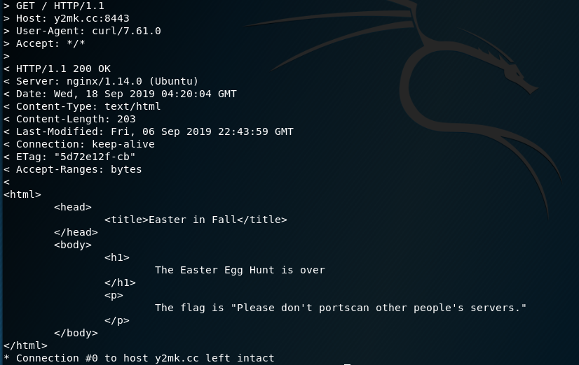

#### Alternatives by [Lookout](https://dayofshecurity.xyz/writeups/eeh):

The vServer hosting `dayofshecurity.xyz` runs web servers on multiple ports serving multiple domains. The challenge is to find these alternate pages and doing so can be tricky.

One approach is to use a passive DNS service such as https://community.riskiq.com/ to find out what domains point to the same IP address as the primary domain. The information available from such services is usually the most complete data available but in this particular case we deliberately left additional breadcrumbs that can help identify alternate domains which are described below.

Since the web server is using SSL, another approach to finding other domains would be to inspect the TLS Certificate used by the server and to find what domain names it has been issued for:

```
$ openssl s_client -showcerts -servername www.example.com -connect dayofshecurity.xyz:443 </dev/null | openssl x509 -text

[...]
Certificate:
    Data:
        Version: 3 (0x2)
        Serial Number:
            04:20:bf:4d:68:99:65:00:4f:66:a9:be:0b:9d:6e:65:05:a0
    Signature Algorithm: sha256WithRSAEncryption
        Issuer: C=US, O=Let's Encrypt, CN=Let's Encrypt Authority X3
        Validity
            Not Before: Aug 15 23:17:48 2019 GMT
            Not After : Nov 13 23:17:48 2019 GMT
        Subject: CN=dayofshecurity.xyz
[...]
        X509v3 extensions:
[...]
            X509v3 Subject Alternative Name:
                DNS:dayofshecurity.xyz, DNS:y2mk.cc
[...]
```

The simplest way to find additional domains is by using a DNS reverse lookup though this only works in cases when the reverse record has been set to the correct domain:

```
$ host -tA dayofshecurity.xyz
dayofshecurity.xyz has address 142.93.151.96

$ host 142.93.151.96
96.151.93.142.in-addr.arpa domain name pointer y2mk.cc.
```

Accessing https://y2mk.cc/ you will get the message that "you are halfway there." The second part to find is the port on which the alternate server is running. Portscanning a server can be interpreted as an attack or at least reconnaissance for one and should therefore not normally be performed on the open internet, which is why we gave explicit permission to portscan this vServer. The most commonly used tool for portscanning is nmap:

```
$ nmap dayofshecurity.xyz
Starting Nmap 7.80 ( https://nmap.org ) at 2019-09-20 15:17 EDT
Nmap scan report for dayofshecurity.xyz (142.93.151.96)
Host is up (0.0056s latency).
rDNS record for 142.93.151.96: y2mk.cc
Not shown: 996 filtered ports
PORT     STATE SERVICE
22/tcp   open  ssh
80/tcp   open  http
443/tcp  open  https
8443/tcp open  https-alt

Nmap done: 1 IP address (1 host up) scanned in 4.64 seconds
```

Conveniently, nap also performs a reverse DNS lookup on the scanned IP address thereby solving both parts of the challenge with a single command. The second domain on the vServer is y2mk.cc and the alternate port is 8443 so to access the flag go to https://y2mk.cc:8443/.

**Flag: Please don't portscan other people's servers.**


---


### [Forensics] Not Quite A Stego-sauras

> [flag.png]()

A simple `ls -la` showed that the image file contains `36382` bytes and that's _huge_. Unfortunately, `file flag.png` doesn't reveal anything amiss -- what about `binwalk`?


Seems that a `zip` file is hidden behind the `png` image, how sneaky. Unzipping it gave me the image containing the flag.

#### Alternatives by [Lookout](https://dayofshecurity.xyz/writeups/nqas):

We are given a file `flag.png` that looks to be a legitimate image. We can view it and there are no signs of corruption, and `file flag.png` gives us the expected answer: `flag.png: PNG image data, 380 x 158, 8-bit/color RGBA, non-interlaced`. As a starting point we can run `strings flag.png` and we'll see some interesting strings:

```
__MACOSX/UX
__MACOSX/._flag.jpgUX
flag.jpgUX
v]PK
```

You may recognise `PK` as the file signature of `zip` files. If so the string output will indicate the presence of a `zip` file within the `png`. If we don't recognise the significance of `PK` we may want to compare our `flag.png` file to other images from legitimate sources. By doing so we'll notice that the `png` images from legitimate sources all seem to have the last 8 bytes being `IEND` + 4 other bytes, but `flag.png` has significantly more bytes following `IEND`.

We want to extract all of the bytes after `IEND`+4 bytes and save them to a new file. We can use our hex editor for this, copying everything from `PK` to the end of the file and saving as new. If we know the significance of `PK` we can skip a step and save the bytes as a `zip` file, and then extract. If not, we will save the bytes as `unknown` and then do `file unknown` which will tell us `unknown: Zip archive data, at least v2.0 to extract`.

After extracting we get `flag.jpg` and can simply open it to view the flag: `{flag-some_bytes_are_magical}`

**Flag: {flag-some_bytes_are_magical}**


---


### [Forensics] An Image is Worth 16 Kilobits

> [image.jpg](./source/imageworth.jpg)

Same as before, `ls -la` reveals that this is definitely a case of steganography. This time, I used `file image.jpg` just to check if the file type is as what the filename claims to be, and oh, something looks interesting.

```
image.jpg: JPEG image data, JFIF standard 1.01, aspect ratio, density 1x1, segment length 16, comment: "e2ZsYWc6NjFhM2NlNDlmYTAyMjkwZjIyYzc1MmM2YjRiZmZiZmRmY2FhYTQ3NDI4NTc4MWU1N30K", progressive, precision 8, 1500x1525, frames 3
```

That looks like a `base64` in the comment section. Decoding via command line gave me the flag, yay!

```
$ echo "e2ZsYWc6NjFhM2NlNDlmYTAyMjkwZjIyYzc1MmM2YjRiZmZiZmRmY2FhYTQ3NDI4NTc4MWU1N30K" | base64 --decode

{flag:61a3ce49fa02290f22c752c6b4bffbfdfcaaa474285781e57}
```

#### Alternatives: `exiftool image.jpg`

`exiftool` is at times, more useful than `file` because it displays more information.

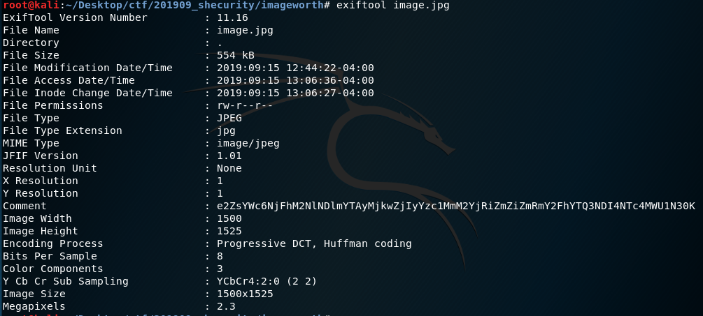

**Flag: {flag:61a3ce49fa02290f22c752c6b4bffbfdfcaaa474285781e57}**


---


### [Forensics] Reversing 101

> The challenge category is accurate.
>
> [flag.jpg](./source/reversing101/flag.jpg)

I quite like this challenge although it took me more than half a day to realize that the clue was literal.

I started off by using `file` to determine the file type. The command returns a `flag.jpg: data` which the [man page](http://man7.org/linux/man-pages/man1/file.1.html) of the `file` command clarifies that it cannot identify the contents. This lead me to investigate the hex dump of the file using `xxd flag.png | head`. We can see that the hex starts of with the consistent pattern of `...(`


This clearly meant that the file in question is not a `jpg` file -- or anything type of file in fact. A proper image file such as this type should have the following sequences:

```
00000000: ffd8 ffe0 0010 4a46 4946 0001            ......JFIF..
```


It was only when I printed out the tails of the hex dump when I noticed something _realllyyy_ interesting. The bytes are actually reversed! Rearranging `FIFJ......` would become `......JFIF`, the proper sequence of a `jpg` file. Wow.

So here's a quick python script to reverse each of the bytes in the `flag.jpg`

```python
with open("flag.jpg", "rb") as file:
	bytes_rev = b""
    bytes_read = bytearray(file.read())

    while bytes_read:
        # read all items in the array, reversed
        bytes_rev += bytes_read[::-1]
        bytes_read = file.read()

    with open("reversed.jpg", "wb") as newfile:
        newfile.write(bytes_rev)
```

Run the script and a new file [reversed.jpg](./source/reversing101/reversed.jpg) would be created. This is the flag!

#### Alternatives by [Lookout](https://dayofshecurity.xyz/writeups/rev101):

Using Bash interpreter, we can do `< flag.jpg xxd -p -c1 | tail -r | xxd -p -r > fixed_flag.jpg` or use plain python to reverse the bits.

```python
flag_bytes = ""

with open("flag.jpg", "rb") as f:
    flag_bytes = f.read()

reversed_bytes = flag_bytes[::-1]

with open("fixed_flag.jpg", "wb") as f:
    f.write(reversed_bytes)
```

**Flag: {flag-into_to_reversing}**

References:

- [F1l3 M1X3R](https://dev.to/atan/solving-a-ctf-challenge-2nbp)
- [SECCON CTF 2014: Reverse it](https://github.com/ctfs/write-ups-2014/tree/master/seccon-ctf-2014/reverse-it)


---


### [Forensics] Sordid Sorting

> Some of these bytes aren't like the others. Perhaps a lexical approach would work best.

#### Alternatives by [Lookout](https://dayofshecurity.xyz/writeups/ss):

After unzipping, we have a set of directories and several files with 12 character names limited to 0-9 and a-f.

We can begin by examining the first file in the first directory:

```
$ hexdump -C brain/33806cd897b8
00000000  47 55 54 53 47 55 54 53  47 55 54 53 47 55 54 53  |GUTSGUTSGUTSGUTS|
*
000002c0  47 55 54 53 47 55 54 53  47 55 54 53              |GUTSGUTSGUTS|
000002cc
```

And it seems uniform. `hexdump` will skip over repeated patterns with the `*` character seen above.

Nothing seems to stand out quite yet, so let's try the second file:

```
$ hexdump -C brain/53ecc6290f0e
00000000  47 55 54 53 47 55 54 53  47 55 54 53 47 55 54 53  |GUTSGUTSGUTSGUTS|
*
000000c0  85 47 55 54 53 47 55 54  53 47 55 54 53 47 55 54  |.GUTSGUTSGUTSGUT|
000000d0  53 47 55 54 53 47 55 54  53 47 55 54 53 47 55 54  |SGUTSGUTSGUTSGUT|
*
00000360  53 47 55 54 53                                    |SGUTS|
00000365
```

Ah, there's a stray byte at offset `0xc0` with a value of `85` in between all the "GUTS".

Since `GUTS` is 4 bytes long, any other file with an odd length must have at least one stray byte. In the first directory, there is one other odd-length file:

```
$ hexdump -C brain/fbb9695c187a
00000000  47 55 54 53 47 55 54 53  47 55 54 53 47 55 54 53  |GUTSGUTSGUTSGUTS|
*
00000060  47 55 54 53 47 55 54 53  f2 47 55 54 53 47 55 54  |GUTSGUTS.GUTSGUT|
00000070  53 47 55 54 53 47 55 54  53 47 55 54 53 47 55 54  |SGUTSGUTSGUTSGUT|
*
00000220  53 47 55 54 53 47 55 54  53 47 55 54 53           |SGUTSGUTSGUTS|
0000022d
```

And so we find `f2`.

So far that gives us `85` and `f2` from two of the files in the first directory. However, we have 479 files spread over 20 directories so examining each file individually would take far too long. Fortunately we can use the `sed` utility to help us out. `sed` can do string replacement, so we can replace all the `GUTS` with an empty string, and what we have left will be any stray bytes:

```
$ cat */* | sed -e 's/GUTS//g' | hexdump -C
00000000  85 f2 e9 a2 e8 e6 83 f6  e2 c7 c6 f5 e5 c7 88 93  |................|
00000010  83 94 e5 d6 e9 e6 e5 92  82 c7 e5 f9 c3 87 7e 7e  |..............~~|
00000020
```

And we can save our results to a file:

```
$ cat */* | sed -e 's/GUTS//g' > /tmp/sordid.bytes
```

The hint for the question mentions **IBM** and a different way to "represent text", so lets do a bit of searching for IBM and character encodings. One of the top results is the `EBCDIC` wikipedia page and is a likely candidate. The `iconv` utility is useful here:

```
$ cat /tmp/sordid.bytes | iconv -f EBCDIC-US -t ascii
e2ZsYWc6SGF5VGhlcmVOZWVkbGV9Cg==
```

We're left with something printable! The `==` at the end tells us that it's extremely likely that we're dealing with a `base64`-encoded string. Decoding it will give us our answer!

```
$ cat /tmp/sordid.bytes | iconv -f EBCDIC-US -t ascii | base64 -d
{flag:HayThereNeedle}
```

**Flag: {flag:HayThereNeedle}**


---


### [Forensics] KittyForensics

> Why is he sad :( ? binwalk, sleuthkit is valuable here.
>
> [shecurity.img](./source/kittyforensics/shecurity.img)

I start off with using `fls shecurity.img` to recursively list all files and directories and determine what was within and what has been deleted from `img` file.

```
d/d 11: lost+found
r/r * 12:       happy_kitten.jpg
r/r 13: lonelykitten.png
r/r 14: message.txt
V/V 2513:       $OrphanFiles
```

From the asterisk, I know that `happy_kitten.jpg` at `inode` 12 had been deleted. Unfortunately, recovering it with `sleuthkit` via `icat shecurity.img 12 > happy_kitten.png` gave me an empty file -- literally zero bytes.

That said, recovering `lonelykitten.png` and `message.txt` shows me some interesting things. First of all, the size of `lonelykitten.png` is huge - a whooping `2451544` bytes. Neither `binwalk` nor `file` reveal anything amiss. It was a PNG image, 1920 x 1080. Maybe it's just huge? _Yes it was just huge_.

The content of `message.txt` does give me some context for `lonelykitten.png`:

```
The kitten is sad because he lost his friend.

The half of the answer:
"SearchingFor"
```

Maybe the answer eludes to `steghide`? Nope, no success even with `steghide extract -sf lonelykitten.png -p "SearchingFor"`:

```
steghide: the file format of the file "lonelykitten.png" is not supported.
```

Aww man, what's going on? Googling around, I realized that maybe `foremost` might be what I need, given that I must to crave out `lonelykitten.png` to find out what's wrong with it. With the command `foremost shecurity.img`, I obtained an folder called `output`. Lo and behold, traversing down the folder brings me to `00016546.jpg` that clearly says: `Second part is "Teefies"`


Concatenating both parts of the message would reveal the flag: `SearchingForTeefies`

#### Alternatives: `binwalk --dd=".*" shecurity.img`

This command would crave out all the files within `shecurity.img` into `_shecurity.img.extracted`. The same file can be found under another name: `814400`

**Flag: SearchingForTeefies**

References:

- [CSAW 2016 - Clams Don't Dance](https://github.com/krx/CTF-Writeups/blob/master/CSAW%2016%20Quals/for100%20-%20Clams%20Dont%20Dance/README.md)
- [StackOverflow - binwalk to extract all files](https://stackoverflow.com/questions/36530643/use-binwalk-to-extract-all-files/53889479#53889479)


---


### [Crypto] All Your Base Are Belong To Us

> [flag.py](./source/basebelongs.py)

```python
def encode(s):
    alpha = "abcdefghijklmnopqrstuvwxyzABCDEFGHIJKLMNOPQRSTUVWXYZ0123456789+/"
    r = ""
    p = ""
    c = len(s)%3
    if c > 0:
        while c < 3:
            p += '='
            s += '\0'
            c += 1
    for i in range(0,len(s),3):
        n = (ord(s[i]) << 16) + (ord(s[i+1]) << 8) + ord(s[i+2])
        n = [(n >> 18) & 63, (n >> 12)&63, (n>>6 & 63), n&63]
        r += alpha[n[0]] + alpha[n[1]] + alpha[n[2]] + alpha[n[3]]
    return r[:len(r) - len(p)] + p

def decode(s):
    raise NotImplementedError

def main():
    flag = 'E2zSywCTCxvPDgvFDgHLx2fSCgHHyMv0Fq=='
    guess = input("Enter flag: ")
    if encode(guess) == flag:
        print("Correct! Good job.")
    else:
        print("Incorrect.")

if __name__ == "__main__":
    main()
```

Solved by my teammate, I thought that this was rather ingenious, given that I was scared away by the large amount of foreign looking codes in this flag file.

From the `main()` function, I can see that a `flag` variable is being initialized as:

```
E2zSywCTCxvPDgvFDgHLx2fSCgHHyMv0Fq==
```

Given the `==` at the back of the string, I now know that this is a `base64` encoded string. However, gibberish was returned when I attempted to convert them into text. From the challenge title, it seems that the operation used in this decoding was customised since the title claimed that the _"base belongs to them"_. I see that this is true from line 2 where `alpha` is initialized as:

```
abcdefghijklmnopqrstuvwxyzABCDEFGHIJKLMNOPQRSTUVWXYZ0123456789+/
```

Using that as the formula, the values was then pumped into a [base64 decoder](<https://gchq.github.io/CyberChef/#recipe=From_Base64('',true)>) to get the flag.


#### Alternatives by [Lookout](https://dayofshecurity.xyz/writeups/aybabtu):

We're given a Python script which takes our input, encodes it, and checks against a flag variable. If they match we know our input was correct. We need to figure out what text will match the variable after being encoded.

To start we need to determine if the encoding algorithm is something standard or unique to the CTF. If you have any prior experience with `base64` encoding you may look at the stored flag, `E2zSywCTCxvPDgvFDgHLx2fSCgHHyMv0Fq==`, and recognise it as possible `base64`. However if we try to `base64` decode this value we end up with what appear to be garbage bytes.

If we are not able to guess `base64` based on the stored flag we could Google the one string from the encode function, `abcdefghijklmnopqrstuvwxyzABCDEFGHIJKLMNOPQRSTUVWXYZ0123456789+/`, and see what we get. The [first result](https://en.wikibooks.org/wiki/Algorithm_Implementation/Miscellaneous/Base64) shows that the implementations listed there are quite similar to what we have in the script with the difference being that the regular algorithm uses characters `ABCDEFGHIJKLMNOPQRSTUVWXYZabcdefghijklmnopqrstuvwxyz0123456789+/` but the script uses `abcdefghijklmnopqrstuvwxyzABCDEFGHIJKLMNOPQRSTUVWXYZ0123456789+/`. The positions of the uppercase and lowercase characters are switched.

At this point we have a few paths forward. The hardest way would be to implement the `base64` decode algorithm using the right characters and decode the stored flag. The easiest way forward would be to fix the encoded flag by inverting the casing and then decode with the standard `base64` algorithm. We can do this by hand or with a Python script.

```python
import base64
import string

flag = "E2zSywCTCxvPDgvFDgHLx2fSCgHHyMv0Fq=="
fixed_flag = ""
for character in flag:
    if character in string.ascii_uppercase:
        fixed_flag += character.lower()
    elif character in string.ascii_lowercase:
        fixed_flag += character.upper()
    else:
        fixed_flag += character

print("Fixed flag: " + fixed_flag)
print("Decoded flag: " + base64.b64decode(fixed_flag))
```

The result would give us

```
Fixed flag: e2ZsYWctcXVpdGVfdGhlX2FscGhhYmV0fQ==
Decoded flag: {flag-quite_the_alphabet}
```

This approach is fine for this challenge because the alphabet change was simple but the alphabet can be changed in more complex ways. A more robust approach to solving this issue is to use a [translation table](https://stackoverflow.com/questions/5537750/decode-base64-like-string-with-different-index-tables) like the one listed in this answer

```python
import string
import base64

my_base64chars  = "abcdefghijklmnopqrstuvwxyzABCDEFGHIJKLMNOPQRSTUVWXYZ0123456789+/"
std_base64chars = "ABCDEFGHIJKLMNOPQRSTUVWXYZabcdefghijklmnopqrstuvwxyz0123456789+/"

flag = "E2zSywCTCxvPDgvFDgHLx2fSCgHHyMv0Fq=="
flag = flag.translate(string.maketrans(my_base64chars, std_base64chars))
flag = base64.b64decode(flag)
print(flag)
```

**Flag: {flag-quite_the_alphabet}**


---


### [Crypto] Le Chiffre

> [flag.py](./source/lechiffre.py)

```python
import string

def encrypt(plaintext):
    key = 'shecurity'
    ciphertext = ""
    i = 0
    # array of lowercase characters where 0 = a, 1 = b, ... , 25 = z
    a = string.ascii_lowercase

    # loop through user input character by character
    for p in plaintext:
      # if the character is a lowercase ascii character
      if p in a:
        # m1 = the index of the character from user input in the lowercase alphabet
        m1 = a.index(p)
        # k1 = the index of the key character in the alphabet
        k1 = a.index(key[i % len(key)])
        # ciphertext index becomes the index of the user input character + the index of the key, mod 26
        c1 = (m1 + k1) % 26
        # convert index to character
        c = a[c1]
        i += 1
      # not a lowercase ascii character, leave as-is
      else:
        c = p
        ciphertext += c
    return ciphertext

def main():
    flag = '{xsei-nym_cmq_vj_elpxmm}'
    guess = input("Enter flag: ")
    if encrypt(guess) == flag:
        print("Correct! Good job.")
    else:
        print("Incorrect.")

if __name__ == "__main__":
    main()
```

Solved by a teammate, the challenge names directs me to the `Le Chiffre cipher`, also known as the `Vigenère cipher`. Using an [online tool](https://cryptii.com/pipes/vigenere-cipher) with `shecurity` as the key and `{xsei-nym_cmq_vj_elpxmm}` as the ciphertext, the flag is obtained.


#### Alternatives by [Lookout](https://dayofshecurity.xyz/writeups/chiffre):

We can implement the decryption function by changing a single line in the script: `c1 = (m1 + k1) % 26` to `c1 = (m1 - k1) % 26`. After changing this line we can call `encrypt(flag)` to receive `{flag-the_joy_of_crypto}`.

**Flag: {flag-the_joy_of_crypto}**


---


### [Crypto] XORuteforce

> Alice and Barbara are writing cryptic messages for each other. Barbara's trashcan has a left over of a torn paper that reads :
>
> ~cidb?%Uwlsdf|%Lv%D%H|qmx
>
> Guess the key , break the cipher, reveal the flag !

The challenge title literally directed me to carry out XOR brute force operation. [Online tools](https://gchq.github.io/CyberChef/) are rather handy for this type of operations.

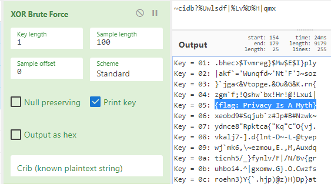

#### Alternatives by [Lookout](https://dayofshecurity.xyz/writeup/XORuteforce):

XOR brute force requires two ingredients; the length of the XOR keys, and the value if the said key. Since this is a beginner level CTF, we can reasonably assume that the key should be 1 byte. [XOR](https://teambi0s.gitlab.io/bi0s-wiki/crypto/xor/) is based on the properties of bitwise XOR logic gate of the following:

```
0 XOR 0 = 0
0 XOR 1 = 1
1 XOR 0 = 1
1 XOR 1 = 0
```

Given that the total number of characters in the ASCII table is 256, there are 256 possibilities for a single byte of XOR key. Hence we need to run through each and every of these 256 possibilities!

```python
!/usr/bin/env
import sys,string,numbers

"""
Brute force a single byte key to get the flag. Cipher is ~cidb?%Uwlsdf|%Lv%D%H|qmx
"""

def xor(msg, key):
  if len(key) != 1:
		# this is the HINT! this part shows us that we are expecting a key of length one bytes
  	raise "incorrect Key length!"

    # if the cipher text is 5 bytes and key is X, by this line we create XXXXX
    key =  key*len(msg)

    # XOR is a bitwise operatoion, so for every byte of the cipher, you need one-byte key.
    if len(msg) != len(key):
      raise "Something is wrong!"

   	sMsg = bytearray(msg)
    sKey = bytearray(key)
    cipher = bytearray()

    for i in range( len(sMsg) ):
      cipher.append( sMsg[i] ^ sKey[i] )	# this is the XOR in python

    return cipher

def main():
  # this is the brute-forcing part, we are trying 128 possibilities
  ciphertext = "~cidb?%Uwlsdf|%Lv%D%H|qmx"

  for x in range(128):
    cipher2 = xor(ciphertext,chr(x))
    print("Key is : \"" + str(x) + "\" and flag is : " + cipher2 + " \r\n" )

if name == 'main': main()
```

**Flag: {flag: Privacy Is A Myth}**


---


### [Misc] TeelX

> Beep Boop
>
> [TeeIX.wav](./source/TeelX.wav)

Given that this is an audio steganography (_coz what else can it be_), I first thought that it might be SSTV related. So I played the audio out in the open and started recording with a tried-and-trusted mobile app, `Robot36`.

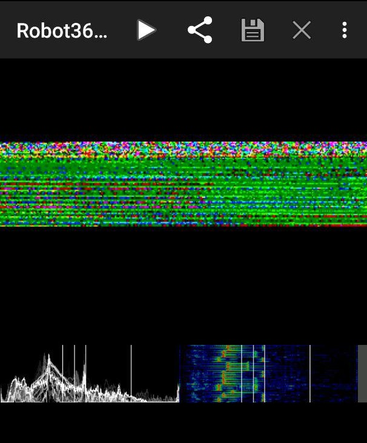

Nope, the main display didn't convert into an image, but what's interesting is the bottom right panel where I can see a series of dots. That brings me to pump the audio into `Sonic Visualiser` and I added a spectrogram into the audio via `Pane > Add Spectrogram`.

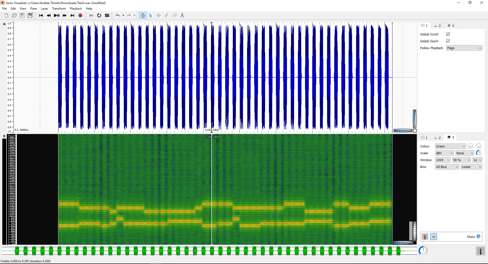

Given the lack of dots and dashes, I ruled out Morse code. Playing the audio multiple times though, I came to realize that it sounded suspiciously similar to the touch tone dialing sequence we had in our pre-smartphone era (_thank god I'm not that young_). Googling brings me to the term [Dual Tone Multi Frequency (DTMF)](https://en.wikipedia.org/wiki/Dual-tone_multi-frequency_signaling). Isolating the tone [manually](https://ctftime.org/writeup/16030) was complicated, but thankfully, I found [dtmf-detect](https://unframework.github.io/dtmf-detect/#/grid) and was able to extract the tone to the following number sequence:

```
33335555224400555544447777777788333666002222555566667777777733355559999
```

I then used an [online decoder](https://www.dcode.fr/multitap-abc-cipher) to solve this `Multi-tap Cipher` and obtain the flag.


**Flag: FLAG LISTEN CLOSELY**


---


### [Puzzle] ACSIIng For A Change

> G 40 0 -11 -68 74 5 -13 -65 -1 91 -21 6 -11 6 -45 42 1 7 8 -19 18 -83 68 5 3 -3 -2 -2 9 6 -8 13 -89 68 5 10 -3 -11 7 -76 68 11 6 -19 18 -1 10
>
> _Hint: If you know where you are then the next step tells you where to go._

The challenge title was a rather obvious hint that ASCII table is involved someone or another. A quick revision, the numbers in ASCII table are how computers - who only understands numbers - interprets characters. With that in mind, I referenced the table to translate `G` into `71`.

Gambling on the assumption that numbers with `-` preceding the numbers are subtract operators, `70 + 40 = 111` would translate into `o`. Continuing with that train of thought would led to the flag!

Here's a manual way of how I did it:

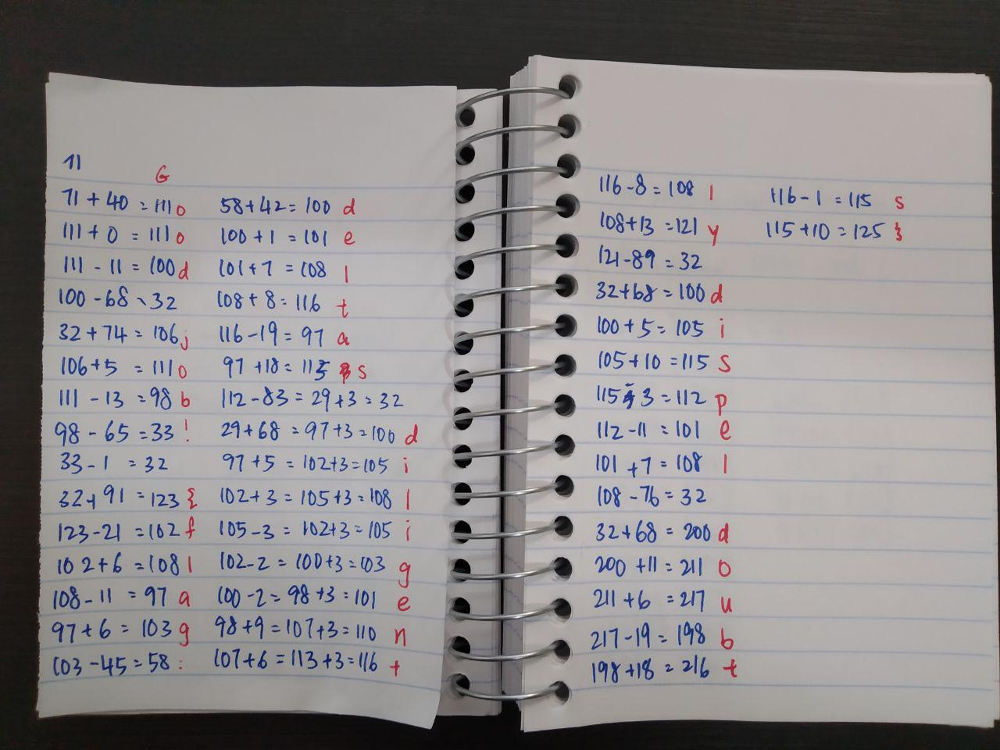

**Flag: {flag: deltas diligently dispel doubts}**


---


### [Puzzle] First Base

> [first_base.txt](./source/firstbase.txt)

#### Alternatives by [Lookout](https://dayofshecurity.xyz/writeups/fb)

Upon opening the challenge we're presented with a single file and no further free clues. Therefore the title must be considered.

Each line contains a single word which seems to not have any connection to the words around it
The file contains 76 of these lines in total, but 4 lines are a set of 4 equal signs. Given the title includes "base" and the last lines are sets of equal signs, there's a high likelihood this challenge involves a `base64` encoded string, and the challenge's official hint confirms this.

The first part of the title is `first` so we can take a closer look at the first character of each line. These characters vary in case, include numbers and have the final four equal signs which definitely follows the set of acceptable symbols for a `base64`-encoded string. The characters can be easily pulled out with a few helpful command-line utilities:

```
$ cut -b 1 first_base.txt | paste -s -d ""
a2ZsYWc6VGhlIGZpcnN0IHRoaW5ncyB5b3Ugbm90aWNlIGlzIG9mdGVuIGltcG9ydGFudH0K====
```

`cut` takes the first byte of each line of the input file while `paste` will merge those separate lines together. So this definitely looks like a `base64`-encoded string, but will it decode properly? Yes it did, here's the flag!

```
$ cut -b 1 first_base.txt | paste -s -d "" | base64 -d
kflag:The first things you notice is often important}
```

**Flag: {flag: The first things you notice is often important}**


---


### [Puzzle] Let's REMAIN friends

> Friends always give 0x100%
>
> ....-----.-....-.... ..---.----.....-.... -......---....-.---- ..---...--...------.----. .----....-...------.....- .-------.......-----..--- ----.-------.......- ..---.-------.....--...-- .-------..--...---..----. ..---.----...--.....---.. ...--....--.... ...-----..----...--- .--------.-----....-..... ..---...--....-.----....- .-----....--...-----..... ..------......-----.
>
> [MorseCode.png](./writeup/RemainFriends_MorseCode.jpg)


Using the Morse code numerals guide given, I inferred that I needed to split the given chunk of Morse into groups of five and convert them into ASCII text.

Parsed Morse:

```
....- ----. -.... -....
..--- .---- ..... -....
-.... ..--- ....- .----
..--- ...-- ...-- ----. ----.
.---- ....- ...-- ----. ....-
.---- ---.. ..... ----- ..---
----. ----- --... ....-
..--- .---- ---.. ...-- ...--
.---- ---.. --... ---.. ----.
..--- .---- ...-- ..... ---..
...-- ....- -....
...-- ---.. ----. ..---
.---- ----. ----- ....- .....
..--- ...-- ....- .---- ....-
.---- -.... --... ----- .....
..--- ---.. ....- ----.
```

Converted result:

```
4966  2156  6241  23399  14394  18502  9074  21833  18789  21358  346  3892  19045  23414  16705  2849
```

Initially confused, I only thought of converting these numbers into `decimals` when I realized that decoding `0x100` from `hex` to `ascii` is impossible. Going by the challenge description of `REMIND`, I realized that this challenge has something to do with the divider operator -- more specifically `modulo`.

Now that I know that, I then `modulo` all converted numbers by `256` individually obtaining:

```
102 108 97 103 58 70 114 73 101 110 90 52 101 118 65 33
```

With an online [decimals to ascii decoder](https://tomeko.net/online_tools/dec_to_ascii.php?lang=en), I got the flag!


**Flag: FrIenZ4evA!**
