It has been a couple of months since I've step afoot into ~~the land of raccoons~~ Canada and I thought that is high time for me to immerse myself into the security community here at downtown Toronto.

Day of Shecurity is one of the very first event that I participated in and had tons of fun working on the CTF with folks I've met there.

Here's some of the challenges writeup.

## Flag Queen 2019

**Event name**: Day of Shecurity Toronto 2019\
**Location**: George Brown College\
**Date**: 14/09/2019 - 18/09/2019\
**Team**: BoT


### [Flag Queen] Veni, vidi, vici

Upon registration, all participants receive a card that looks like this.


The line at the bottom looks weird but `://` and `.klm/` was a dead giveaway that it was a URL link. `ROT13 cipher` easily reveal `uggcf://qnlbsfurphevgl.klm` to be `https://dayofshecurity.xyz`

**Flag: https://dayofshecurity.xyz**

### [Web] Oh, yes. Little Bobby Tables we call him

> The backend devs of this Super Secure Site (TM) thought they'd protected their users' personal data. But, they've missed some things.
>
> First you find the data, then you get the points, then you get the power.
>
> https://chmodxx.net/dos

With the challenge named [Little Bobby](https://xkcd.com/327/), there was little to no doubt that this challenge requires some form of SQL injection. With that in mind, I did a quick survey on the website in general. It only consist of a normal login page with some form of validation being enforced. Poking around, I noticed that any attempt to submit data from the frontend would have their data sanitized with the `serialize()` command.


Nevertheless, I tried the usual SQL injection statement to see if the login form is vulnerable. Lo and behold, it is. Now that I know that the site vulnerable from the frontend attack vector, I proceed to check the backend too.

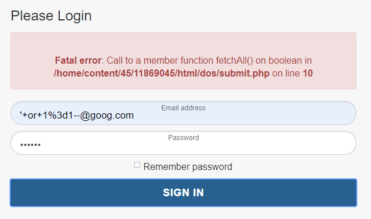

Copying the request I made from the `Network` panel as a `curl` request, I tried submitting `'1 or 1=1--` as the injection statement. Nope, that didn't work out -- I got the same fatal error as above. When I changed the injection statement to `' or 1=1--` though, I got something different, which unfortunately, is not the flag. _Whyyyyy?_

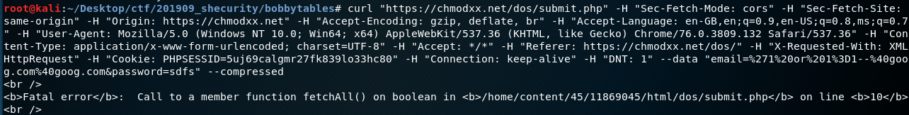


The answer lies in how the `curl` request was constructed. The `curl` I used contains a `Cookie` value specific to the browser session hence even if the injection were successful, I wouldn't have been able to see anything within the terminal. I actually needed to go back to my browser that _hasn't been closed_ and _refresh_ the page to see the flag!

```
curl "https://chmodxx.net/dos/submit.php"
	[TRUNCATED]
-H "Cookie: PHPSESSID=5uj69calgmr27fk839lo33hc80" -H "Connection: keep-alive" -H "DNT: 1" --data "email=%27%20or%201%3D1--&password=sadfsdf" --compressed
```

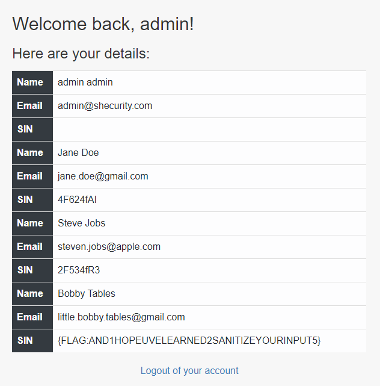

**Flag: {FLAG:AND1HOPEUVELEARNED2SANITIZEYOURINPUT5}**

### [Hunting] Easter Egg Hunt

> I wonder what else is going on on this vserver...
>
> You'll learn some useful skills for this challenge at "Reversing and Exploring The World of Mobile Apps: Android APKs"
>
> URL: [https://dayofshecurity.xyz](https://dayofshecurity.xyz)

Googling `vserver` reveals that this is just a term for virtual private server like Digital Ocean, Heroku etc. With the challenge description in mind, I went ahead to do a reverse lookup on the URL given via [Shodan.io](https://www.shodan.io/host/142.93.151.96).

Right off the bat, I saw something interesting - the IP address `142.93.151.96` actually has its hostname set as `y2mk.cc`. Several ports are also opened: 22, 80, 443, 8443. This result coincides with what I would see if I were to run [nmap](../assets/201909_shecurity/y2mk.nmap) using `nmap -sc -sV -oA y2mk 142.93.151.96`

Visiting `y2mk.cc` tells me that I am on the correct path:

> You're halfway there!
>
> Yep, you've found something else on this vserver but you're not quite there yet.

Here comes the confusing part - `curl` commands.

`curl -i 142.93.151.96:443` returns a `400 Bad Request` because `The plain HTTP request was sent to HTTPS port`. This was weird, given that `nmap` clearly tells says that I should be seeing what `y2mk.cc` displays - after all, the value of `http-title` is `Halfway there`.


What is going on here? The key lies in how web-servers serves their content. In the current internet where multiple domains can exist in one IP address, there is a need for servers like `nginx` to be able to serve different contents to different domain names. How this is carried out is done via the `host` attribute in the request header.

One thing to note is that in _this_ server, IP address and domain names are considered to be different thing - despite resolving into the same thing - and hence will serve different content. This makes sense considering the previous `curl` error message says the server would port forward any request to `https`. Inputting `https://y2mk.cc:8443` as the curl parameter would have revealed the flag.


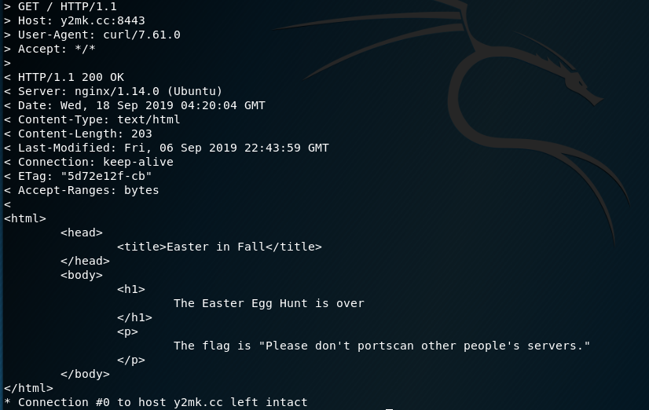

**Flag: Please don't portscan other people's servers.**

### [Forensics] Not Quite A Stego-sauras

> [flag.png]()

A simple `ls -la` showed that the image file contains `36382` bytes and that's _huge_. Unfortunately, `file flag.png` doesn't reveal anything amiss -- what about `binwalk`?


Seems that a `zip` file is hidden behind the `png` image, how sneaky. Unzipping it gave me the image containing the flag.

**Flag: {flag-some_bytes_are_magical}**

### [Forensics] An Image is Worth 16 Kilobits

> [image.jpg]()

Same as before, `ls -la` reveals that this is definitely a case of steganography. This time, I used `file image.jpg` just to check if the file type is as what the filename claims to be, and oh, something looks interesting.

```
image.jpg: JPEG image data, JFIF standard 1.01, aspect ratio, density 1x1, segment length 16, comment: "e2ZsYWc6NjFhM2NlNDlmYTAyMjkwZjIyYzc1MmM2YjRiZmZiZmRmY2FhYTQ3NDI4NTc4MWU1N30K", progressive, precision 8, 1500x1525, frames 3
```

That looks like a `base64` in the comment section. Decoding via command line gave me the flag, yay!

```
$ echo "e2ZsYWc6NjFhM2NlNDlmYTAyMjkwZjIyYzc1MmM2YjRiZmZiZmRmY2FhYTQ3NDI4NTc4MWU1N30K" | base64 --decode

{flag:61a3ce49fa02290f22c752c6b4bffbfdfcaaa474285781e57}
```

**Flag: {flag:61a3ce49fa02290f22c752c6b4bffbfdfcaaa474285781e57}**

### [Forensics] Reversing 101

> The challenge category is accurate.
>
> [flag.jpg]()

I quite like this challenge although it took me more than half a day to realize that the clue was literal.

I started off by using `file` to determine the file type. The command returns a `flag.jpg: data` which the [man page](http://man7.org/linux/man-pages/man1/file.1.html) of the `file` command clarifies that it cannot identify the contents. This lead me to investigate the hex dump of the file using `xxd flag.png | head`. We can see that the hex starts of with the consistent pattern of `...(`


This clearly meant that the file in question is not a `jpg` file -- or anything type of file in fact. A proper image file such as this type should have the following sequences:

```
00000000: ffd8 ffe0 0010 4a46 4946 0001            ......JFIF..
```


It was only when I printed out the tails of the hex dump when I noticed something _realllyyy_ interesting. The bytes are actually reversed! Rearranging `FIFJ......` would become `......JFIF`, the proper sequence of a `jpg` file. Wow.

So here's a quick python script to reverse each of the bytes in the `flag.jpg`

```python
with open("flag.jpg", "rb") as file:
	bytes_rev = b""
    bytes_read = bytearray(file.read())

    while bytes_read:
        # read all items in the array, reversed
        bytes_rev += bytes_read[::-1]
        bytes_read = file.read()

    with open("reversed.jpg", "wb") as newfile:
        newfile.write(bytes_rev)
```

Run the script and a new file [reversed.jpg](./source/reversing101/reversed.jpg) would be created. This is the flag!

**Flag: {flag-into_to_reversing}**

### [Forensics] KittyForensics

> Why is he sad :( ? binwalk, sleuthkit is valuable here.
>
> [shecurity.img]()

I start off with using `fls shecurity.img` to recursively list all files and directories and determine what was within and what has been deleted from `img` file.

```
d/d 11: lost+found
r/r * 12:       happy_kitten.jpg
r/r 13: lonelykitten.png
r/r 14: message.txt
V/V 2513:       $OrphanFiles
```

From the asterisk, I know that `happy_kitten.jpg` at `inode` 12 had been deleted. Unfortunately, recovering it with `sleuthkit` via `icat shecurity.img 12 > happy_kitten.png` gave me an empty file -- literally zero bytes.

That said, recovering `lonelykitten.png` and `message.txt` shows me some interesting things. First of all, the size of `lonelykitten.png` is huge - a whooping `2451544` bytes. Neither `binwalk` nor `file` reveal anything amiss. It was a PNG image, 1920 x 1080. Maybe it's just huge? _Yes it was just huge_.

The content of `message.txt` does give me some context for `lonelykitten.png`:

```
The kitten is sad because he lost his friend.

The half of the answer:
"SearchingFor"
```

Maybe the answer eludes to `steghide`? Nope, no success even with `steghide extract -sf lonelykitten.png -p "SearchingFor"`:

```
steghide: the file format of the file "lonelykitten.png" is not supported.
```

Aww man, what's going on? Googling around, I realized that maybe `foremost` might be what I need, given that I must to crave out `lonelykitten.png` to find out what's wrong with it. With the command `foremost shecurity.img`, I obtained an folder called `output`. Lo and behold, traversing down the folder brings me to `00016546.jpg` that clearly says: `Second part is "Teefies"`

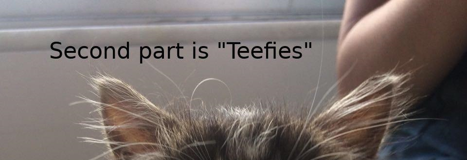

Concatenating both parts of the message would reveal the flag: `SearchingForTeefies`

**Flag: SearchingForTeefies**

### [Crypto] All Your Base Are Belong To Us

> [flag.py]()

```python
def encode(s):
    alpha = "abcdefghijklmnopqrstuvwxyzABCDEFGHIJKLMNOPQRSTUVWXYZ0123456789+/"
    r = ""
    p = ""
    c = len(s)%3
    if c > 0:
        while c < 3:
            p += '='
            s += '\0'
            c += 1
    for i in range(0,len(s),3):
        n = (ord(s[i]) << 16) + (ord(s[i+1]) << 8) + ord(s[i+2])
        n = [(n >> 18) & 63, (n >> 12)&63, (n>>6 & 63), n&63]
        r += alpha[n[0]] + alpha[n[1]] + alpha[n[2]] + alpha[n[3]]
    return r[:len(r) - len(p)] + p

def decode(s):
    raise NotImplementedError

def main():
    flag = 'E2zSywCTCxvPDgvFDgHLx2fSCgHHyMv0Fq=='
    guess = input("Enter flag: ")
    if encode(guess) == flag:
        print("Correct! Good job.")
    else:
        print("Incorrect.")

if __name__ == "__main__":
    main()
```

Solved by my teammate, I thought that this was rather ingenious, given that I was scared away by the large amount of foreign looking codes in this flag file.

From the `main()` function, I can see that a `flag` variable is being initialized as:

```
E2zSywCTCxvPDgvFDgHLx2fSCgHHyMv0Fq==
```

Given the `==` at the back of the string, I now know that this is a `base64` encoded string. However, gibberish was returned when I attempted to convert them into text. From the challenge title, it seems that the operation used in this decoding was customized since the title claimed that the _"base belongs to them"_. I see that this is true from line 2 where `alpha` is initialized as:

```
abcdefghijklmnopqrstuvwxyzABCDEFGHIJKLMNOPQRSTUVWXYZ0123456789+/
```

Using that as the formula, the values was then pumped into a [base64 decoder](<https://gchq.github.io/CyberChef/#recipe=From_Base64('',true)>) to get the flag.


**Flag: {flag-quite_the_alphabet}**

### [Crypto] Le Chiffre

> [flag.py]()

```python
import string

def encrypt(plaintext):
    key = 'shecurity'
    ciphertext = ""
    i = 0
    # array of lowercase characters where 0 = a, 1 = b, ... , 25 = z
    a = string.ascii_lowercase

    # loop through user input character by character
    for p in plaintext:
      # if the character is a lowercase ascii character
      if p in a:
        # m1 = the index of the character from user input in the lowercase alphabet
        m1 = a.index(p)
        # k1 = the index of the key character in the alphabet
        k1 = a.index(key[i % len(key)])
        # ciphertext index becomes the index of the user input character + the index of the key, mod 26
        c1 = (m1 + k1) % 26
        # convert index to character
        c = a[c1]
        i += 1
      # not a lowercase ascii character, leave as-is
      else:
        c = p
        ciphertext += c
    return ciphertext

def main():
    flag = '{xsei-nym_cmq_vj_elpxmm}'
    guess = input("Enter flag: ")
    if encrypt(guess) == flag:
        print("Correct! Good job.")
    else:
        print("Incorrect.")

if __name__ == "__main__":
    main()
```

Solved by a teammate, the challenge names directs me to the `Le Chiffre cipher`, also known as the `Vigenère cipher`. Using an [online tool](https://cryptii.com/pipes/vigenere-cipher) with `shecurity` as the key and `{xsei-nym_cmq_vj_elpxmm}` as the cipher-text, the flag is obtained.


**Flag: {flag-the_joy_of_crypto}**

### [Crypto] XORuteforce

> Alice and Barbara are writing cryptic messages for each other. Barbara's trashcan has a left over of a torn paper that reads :
>
> ~cidb?%Uwlsdf|%Lv%D%H|qmx
>
> Guess the key , break the cipher, reveal the flag !

The challenge title literally directed me to carry out XOR brute force operation. [Online tools](https://gchq.github.io/CyberChef/) are rather handy for this type of operations.


**Flag: {flag: Privacy Is A Myth}**

### [Misc] TeelX

> Beep Boop
>
> [TeeIX.wav]()

Given that this is an audio steganography (_coz what else can it be_), I first thought that it might be SSTV related. So I played the audio out in the open and started recording with a tried-and-trusted mobile app, `Robot36`.

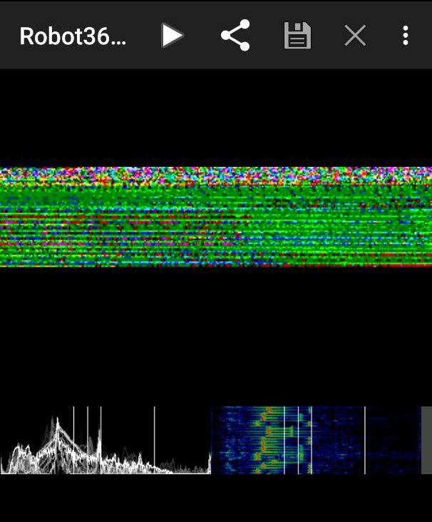

Nope, the main display didn't convert into an image, but what's interesting is the bottom right panel where I can see a series of dots. That brings me to pump the audio into `Sonic Visualiser` and I added a spectrogram into the audio via `Pane > Add Spectrogram`.

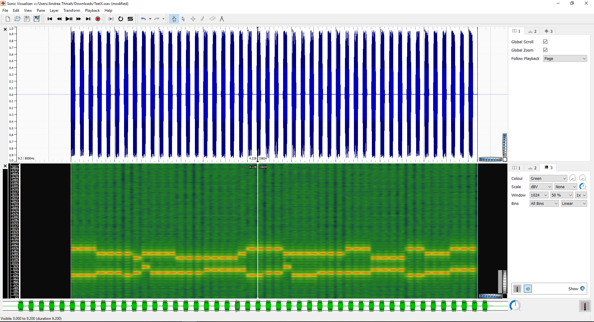

Given the lack of dots and dashes, I ruled out Morse code. Playing the audio multiple times though, I came to realize that it sounded suspiciously similar to the touch tone dialing sequence we had in our pre-smartphone era (_thank god I'm not that young_). Googling brings me to the term [Dual Tone Multi Frequency (DTMF)](https://en.wikipedia.org/wiki/Dual-tone_multi-frequency_signaling). Isolating the tone [manually](https://ctftime.org/writeup/16030) was complicated, but thankfully, I found [dtmf-detect](https://unframework.github.io/dtmf-detect/#/grid) and was able to extract the tone to the following number sequence:

```
33335555224400555544447777777788333666002222555566667777777733355559999
```

I then used an [online decoder](https://www.dcode.fr/multitap-abc-cipher) to solve this `Multi-tap Cipher` and obtain the flag.

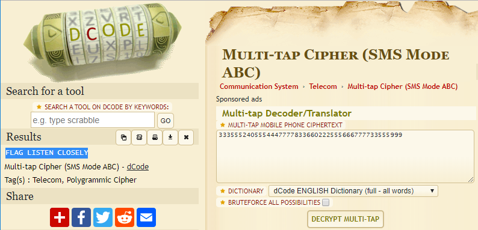

**Flag: FLAG LISTEN CLOSELY**

### [Puzzle] ACSIIng For A Change

> G 40 0 -11 -68 74 5 -13 -65 -1 91 -21 6 -11 6 -45 42 1 7 8 -19 18 -83 68 5 3 -3 -2 -2 9 6 -8 13 -89 68 5 10 -3 -11 7 -76 68 11 6 -19 18 -1 10
>
> _Hint: If you know where you are then the next step tells you where to go._

The challenge title was a rather obvious hint that ASCII table is involved someone or another. A quick revision, the numbers in ASCII table are how computers - who only understands numbers - interprets characters. With that in mind, I referenced the table to translate `G` into `71`.

Gambling on the assumption that numbers with `-` preceding the numbers are subtract operators, `70 + 40 = 111` would translate into `o`. Continuing with that train of thought would led to the flag!

Here's a manual way of how I did it:

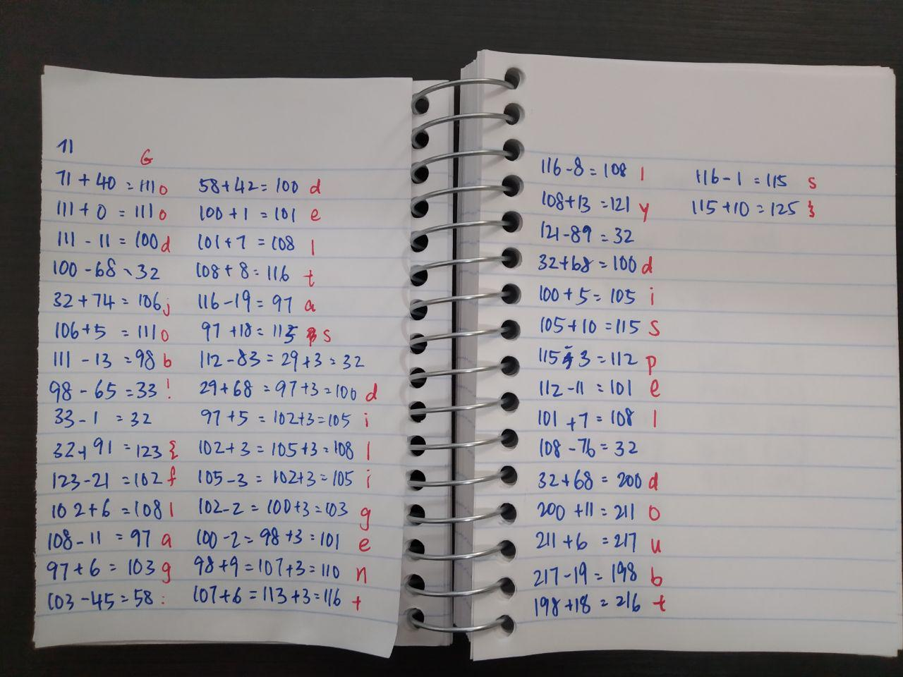

**Flag: {flag: deltas diligently dispel doubts}**

### [Puzzle] Let's REMAIN friends

> Friends always give 0x100%
>
> ....-----.-....-.... ..---.----.....-.... -......---....-.---- ..---...--...------.----. .----....-...------.....- .-------.......-----..--- ----.-------.......- ..---.-------.....--...-- .-------..--...---..----. ..---.----...--.....---.. ...--....--.... ...-----..----...--- .--------.-----....-..... ..---...--....-.----....- .-----....--...-----..... ..------......-----.
>
> [MorseCode.png](../assets/201909_shecurity/RemainFriends_MorseCode.jpg)

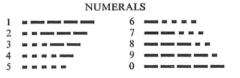

Using the Morse code numerals guide given, I inferred that I needed to split the given chunk of Morse into groups of five and convert them into ASCII text.

Parsed Morse:

```
....- ----. -.... -....
..--- .---- ..... -....
-.... ..--- ....- .----
..--- ...-- ...-- ----. ----.
.---- ....- ...-- ----. ....-
.---- ---.. ..... ----- ..---
----. ----- --... ....-
..--- .---- ---.. ...-- ...--
.---- ---.. --... ---.. ----.
..--- .---- ...-- ..... ---..
...-- ....- -....
...-- ---.. ----. ..---
.---- ----. ----- ....- .....
..--- ...-- ....- .---- ....-
.---- -.... --... ----- .....
..--- ---.. ....- ----.
```

Converted result:

```
4966  2156  6241  23399  14394  18502  9074  21833  18789  21358  346  3892  19045  23414  16705  2849
```

Initially confused, I only thought of converting these numbers into `decimals` when I realized that decoding `0x100` from `hex` to `ascii` is impossible. Going by the challenge description of `REMIND`, I realized that this challenge has something to do with the divider operator -- more specifically `modulo`.

Now that I know that, I then `modulo` all converted numbers by `256` individually obtaining:

```
102 108 97 103 58 70 114 73 101 110 90 52 101 118 65 33
```

With an online [decimals to ascii decoder](https://tomeko.net/online_tools/dec_to_ascii.php?lang=en), I got the flag!

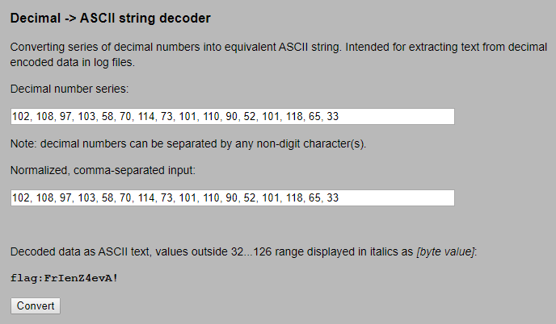

**Flag: FrIenZ4evA!**
