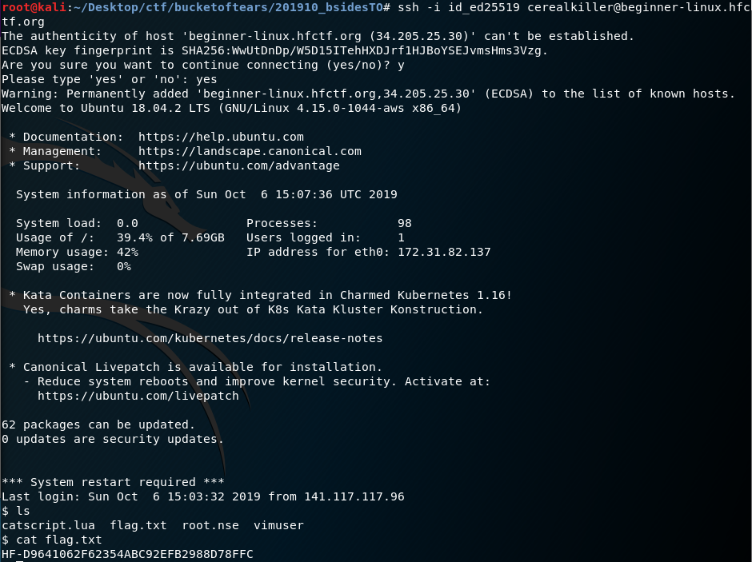
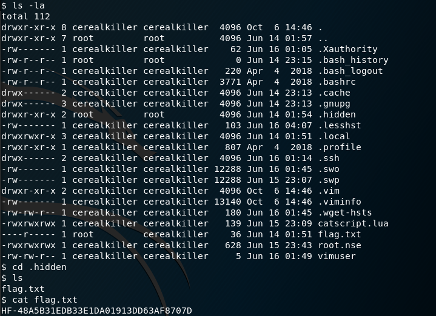

Another day, another security event. Unlike Day of Shecurity (DOS) -- whose CTF were mainly catered for begineers -- Bsides Toronto's CTF was very much harder.

Coincidently, I banged into folks I've met while in DOS at this event and was lucky enough to team with Brandon from ThreatGRID Cisco where I learned tons from picking his brains for ideas and solutions!

## Bsides Toronto 2019 CTF

**Event name**: Bsides Toronto 2019\
**Location**: Ryerson University\
**Date**: 06/10/2019\
**Team**: BoT


### [Web] Encrypted

> This simple file contains 3 flags. Can you dig deep enough?
>
> 01100001 01010110 01100101 01110010 01111001 01010011 01110100 01110010 01101111 01101110 01100111 01010000 01100001 01110011 01110011 01110000 01101000 01110010 01100001 01110011 01100101
>
> [FILE.zip.gpg]()

After decoding binary to ASCII via `base64 --decode`, we obtained `aVeryStrongPassphrase`. Using `file FILE.zip.gpg`, we obtain `FILE.zip.gpg: GPG symmetrically encrypted data (AES cipher)`.

Entering the passphrase when prompted by `gpg FILE.zip.gpg` would produce `flag.txt` and `flag.jpg` for this challenge and the next challenge respectively.

**Flag: ykhti36b2thircqwr31sm17x7wpxsj4b**

### [Web] Crawler

> What page does a crawler check to see where he can and cannot go? Use the server [beginner-web.hfctf.org](http://beginner-web.hfctf.org/). The answer is a full flag not just the file name.

We are greeted with a default apache page here. Given the challenge name, accessing `beginner-web.hfctf.org/robots.txt` provides us with our flag!

**Flag: HF-DA371569A494D6953447F68C2F6316B2**

### [Web] Port Scan

> By default, nmap will only scan the top 1000 ports. Can you learn how to fix this? If you find a weird port, you can poke it with nc (netcat).
>
> Address: [beginner-web.hfctf.org](http://beginner-web.hfctf.org/)
>
> Recommended Tools: nmap, nc (netcat)

From the manual, we know that to scan all ports, `-p-` flag is needed.

```
nmap -sC -sV -p- -oA hackfest beginner-web.hfctf.org

# Nmap 7.70 scan initiated Sun Oct  6 10:08:55 2019 as: nmap -sC -sV -p- -oA hackfest beginner-web.hfctf.org
Nmap scan report for beginner-web.hfctf.org (3.92.223.240)
Host is up (0.00052s latency).
rDNS record for 3.92.223.240: ec2-3-92-223-240.compute-1.amazonaws.com
Not shown: 65531 filtered ports
PORT      STATE SERVICE    VERSION
22/tcp    open  tcpwrapped
| ssh-hostkey:
|   2048 8c:86:62:de:2d:34:11:8c:39:86:c4:a8:03:10:3d:fd (RSA)
|   256 e4:7b:74:cb:34:f3:ab:b8:5f:60:d4:0a:de:d0:13:c7 (ECDSA)
|_  256 70:2d:af:8a:68:e1:f5:94:a7:97:a0:54:f8:b5:85:02 (ED25519)
53/tcp    open  tcpwrapped
80/tcp    open  tcpwrapped
|_http-server-header: Apache/2.4.29 (Ubuntu)
|_http-title: Apache2 Ubuntu Default Page: It works
13337/tcp open  tcpwrapped
```

We see here that port `13337` opened. Probing it with `nc begineer-web.hfctf.org 13337` will return us with the flag!

**Flag: HF-6DA40A2D1CBA006ABAC5663543B69994**

### [Cipher] Base64

> If you see a string that seems encoded, contains only numbers, letters, / and = and might finish with either one or two = (but not all the time) you should try this decoding method. It is also used by pentesters to transfer files over the network and to make sure we are not missing any parts.
>
> Here is the string : SEYtNmQzZTdmMTlhNjhlM2FjOWY4ZGM2ODNhYTJlNjFlZDY=

We can decode `base64` with `echo "SEYtNmQzZTdmMTlhNjhlM2FjOWY4ZGM2ODNhYTJlNjFlZDY=" | base64 --decode` to return us the flag!

**Flag: HF-6d3e7f19a68e3ac9f8dc683aa2e61ed6**

### [Cipher] Julius

> One of the first used cipher in history.
>
> XV-vvrru3u1627s71rvru5suut8sus9s6q9

Caesar cipher is named after Julius Caesar and is one of the earliest known and simplest cipher. Essentially a `ROT13` cipher, key 10 would give us our flag!


**Flag: HF-ffbbe3e1627c71bfbe5ceed8cec9c6a9**

### [Linux] SSH Key

> You are given an SSH key to the kingdom, do you know how to use it?
>
> If you do, use it at [beginner-linux.hfctf.org](http://beginner-linux.hfctf.org/) with the user `cerealkiller`.

```
chmod 600 id_ed25519
ssh -i id_ed25519 cerealkiller@beginner-linux.hfctf.org
```



Checking the directory, we see a `flag.txt` file! `cat`-ing the contents would provide us with our flag!

**Flag: HF-D9641062F62354ABC92EFB2988D78FFC**

### [Linux] Hidden File

> Get a shell as the user `cerealkiller` with the previous SSH key and look for a hidden file.
>
> Requirement: You need to have done the SSH Challenge first



Examining the directory carefully, we see a hidden folder named `.hidden`. Accessing it, we see another `flag.txt` file. The contents reveals our flag!

**Flag: HF-48A5B31EDB33E1DA01913DD63AF8707D**

### [Linux] Sudo

> The user `cerealkiller` has some `sudo` privileges. Learn to use `sudo` to be able to read the flag in the user "phantom" home directory

With `sudo -l`, we can check what kind of `sudo` privileges `cerealkiller` has:

```
Matching Defaults entries for cerealkiller on ip-172-31-82-137:
    env_reset, mail_badpass,
    secure_path=/usr/local/sbin\:/usr/local/bin\:/usr/sbin\:/usr/bin\:/sbin\:/bin\:/snap/bin

User cerealkiller may run the following commands on ip-172-31-82-137:
    (phantom) NOPASSWD: ALL
    (vimuser) NOPASSWD: /usr/bin/vim
    (nmapuser) NOPASSWD: /usr/bin/nmap
```

From here, we know that `cerealkiller` can access all of `phantom`'s file. That means `cat home/phantom/flag.txt` would work right? Nope! We got a `permission denied` error message. _Whyyyy?_

This is because **EXPLAINATION HERE**. To get our flag, we should assume `phantom`'s' identity to read the file via `sudo -u phantom cat flag.txt`.


**Flag: HF-37C24811BDAC007720BB8FF868386C0F**

### [Linux] Vim

> Vim is a popular text editor for Linux, but there are a lot more that you can do with it rather than just editing text. Can you find out what?

I learnt lots of stuff today and this was one that blew my mind away.

Just like before, we start by assuming the identity of `vimuser` to create a vim file through `sudo -u vimuser vim switch.txt`.

Now that we are in a new vim file, we can spawn a new bash terminal with `!/bin/sh` through vim's terminal! With `whoami` command, we can confirm that we are currently logged in as `vimuser`.

Accessing the contents of `/home/vimuser/flag.txt` would give us our flag!

**Flag: HF-0224B9BFA1235B2D5CE597E73B089C3C**

### [Crypto] Hash you said Hash?

> I've found a hash and I'm sure it's my password for my file ;( how can I know what it is?
>
> Can you help me!
>
> Hash: 7740b5345bc0f61056c125db6fae5bfc

Using an [online tool](https://crackstation.net/), we can easily crack the hash `7740b5345bc0f61056c125db6fae5bfc` to `1INFRASTRUCTURES`

### [Privacy] LazyTiger

> It's incredible all we can see on this picture! A Lazy Tiger surely! but.....
>
> [LazyTiger]()

Running `exiftool` shows us a bunch of interesting details on where the photograph was taken.

```
ExifTool Version Number         : 11.16
File Name                       : LazyTiger.jpg
Directory                       : .
File Size                       : 382 kB
File Modification Date/Time     : 2019:10:06 12:48:08-04:00
File Access Date/Time           : 2019:10:06 12:48:22-04:00
File Inode Change Date/Time     : 2019:10:06 12:48:10-04:00
File Permissions                : rw-r--r--
File Type                       : JPEG
File Type Extension             : jpg
MIME Type                       : image/jpeg
JFIF Version                    : 1.01
X Resolution                    : 96
Y Resolution                    : 96
Exif Byte Order                 : Big-endian (Motorola, MM)
Make                            : TigerBrand
Camera Model Name               : SuperPro
Resolution Unit                 : None
Y Cb Cr Positioning             : Centered
Exif Version                    : 0230
Components Configuration        : Y, Cb, Cr, -
Flashpix Version                : 0100
Lens Make                       : ATM
Lens Model                      : CTF
Lens Serial Number              : 666C61677B6173747574655F74696765727D
GPS Latitude Ref                : North
GPS Longitude Ref               : East
Padding                         : (Binary data 2060 bytes, use -b option to extract)
IPTC Digest                     : d41d8cd98f00b204e9800998ecf8427e
Warning                         : [minor] Fixed incorrect URI for xmlns:MicrosoftPhoto
About                           : uuid:faf5bdd5-ba3d-11da-ad31-d33d75182f1b
Camera Serial Number            : 666C61677B6173747574655F74696765727D
Image Width                     : 1200
Image Height                    : 900
Encoding Process                : Baseline DCT, Huffman coding
Bits Per Sample                 : 8
Color Components                : 3
Y Cb Cr Sub Sampling            : YCbCr4:2:0 (2 2)
GPS Latitude                    : 53 deg 33' 53.95" N
GPS Longitude                   : 106 deg 17' 42.92" E
GPS Position                    : 53 deg 33' 53.95" N, 106 deg 17' 42.92" E
Image Size                      : 1200x900
Megapixels                      : 1.1
```

With the challenge description being `privacy`, I thought that the GPS position would be important. Converting `53 deg 33' 53.95" N, 106 deg 17' 42.92" E` to decimals: `53.5649861,106.29525555555556` revealed that the picture was taken at `Kachugsky District, Irkutsk Oblast, Russia`.

After discussing this challenge with Brandon, he noticed that the serial number could actually be decoded to `hex`.

```python
python -c "print('666C61677B6173747574655F74696765727D'.decode('hex'))"
flag{astute_tiger}
```

**Flag: flag{astute_tiger}**

### [SDR] Look around...

> Head to https://sdr.hfctf.org/
>
> Look around this webpage. Can-you find anything revolving around the "CDN" it uses?
>
> Flag is case-sensitive

Poking around the site for any CDN related words, a network request caught my eye!


Accessing `https://sdr-cdn.hfctf.org/images/pic02.jpg` redirected me to `https://s3.us-east-1.amazonaws.com/flag-qg7y1k1cjjozpov03uwn/images/pic02.jpg`

We found our flag!

**Flag: flag-qg7y1k1cjjozpov03uwn**

### [SDR] Look into the clouds

> Head to https://sdr.hfctf.org/
>
> Look around this webpage. Can-you do some kind of modern-day directory-listing?

Continuing from the previous challenge, we obtain the link of `https://s3.us-east-1.amazonaws.com/flag-qg7y1k1cjjozpov03uwn/images/pic02.jpg`, what happens when we traverse back the directory.


Oooh, an XML file. Beautiful. At the very bottom, we see something suspicious!

```xml
<Contents>
	<Key>you_should_not_see_this_file.txt</Key>
	<LastModified>2019-06-04T03:54:13.000Z</LastModified>
	<ETag>"07f0425001b94325d04e542fb8ef23bd"</ETag>
	<Size>26</Size>
	<StorageClass>STANDARD</StorageClass>
</Contents>
```

Accessing `https://s3.us-east-1.amazonaws.com/flag-qg7y1k1cjjozpov03uwn/you_should_not_see_this_file.txt` gives us our flag!

**Flag: FLAG-bKrdxHOcXwDkOnWb6i4p**
