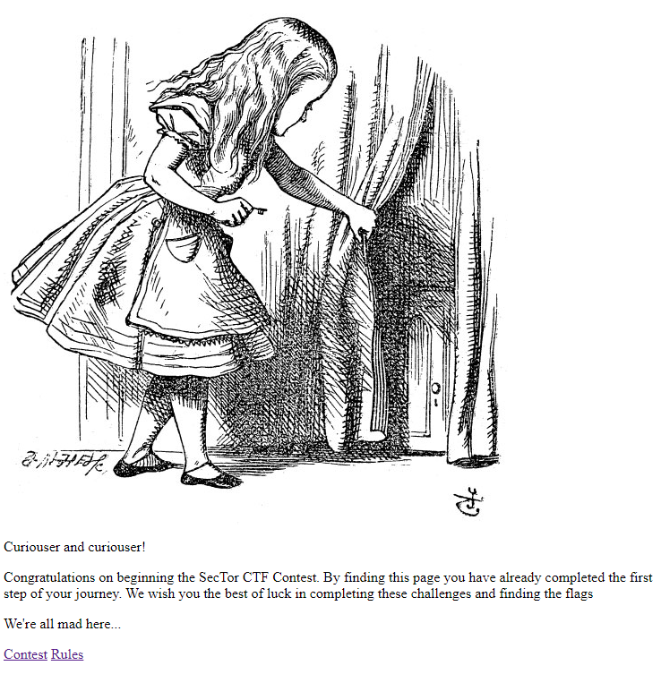
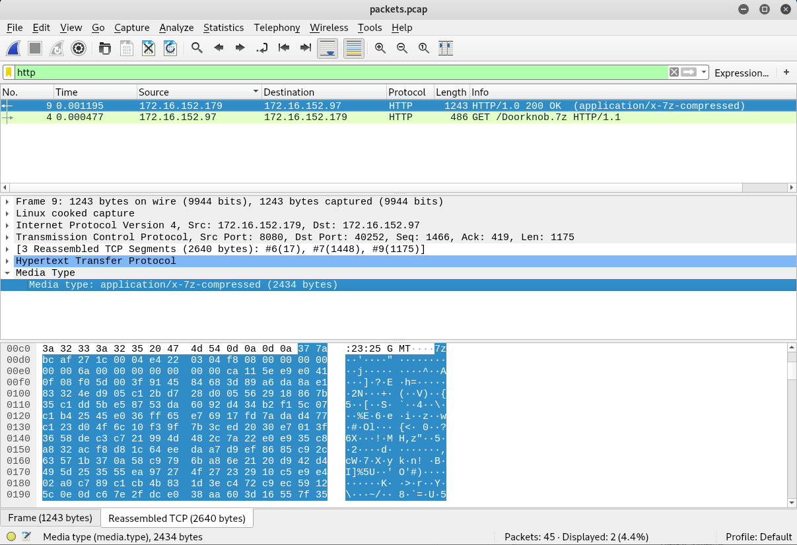

SecTor is one of Canada's biggest security conference and I was lucky enough to snag a ticket from [OWASP Toronto Chapter](https://owasp.org/www-chapter-toronto/).

It is also the first security event that I went together with folks from @ecobee. Lee -- my super supportive boss -- even had extra tickets for me to participate in the after-party. Unfortunately, I had classes that night. Boooooooo!!

## SecTor 2019 CTF

**Event name**: SecTor 2019\
**Location**: Metro Toronto Convention Centre\
**Date**: 09/10/2019 - 10/10/2019\
**Team**: Individual

Upon registration, all attendees are given a physical copy of a pocket guide that details the conference details. Looking closely at one of the pages, we can see that a CTF is totally taking place!


### Flag 1

Squinting at the far left of the image, we see a `base64` encoded string, _interesting_! Following the instructions on the page, I eventually found the _Nuix + Dolos Group_ booth at Hall 700 and was given the link to the CTF platform: [sector2019ctf.online](sectorctf2019.online).

Here's the cute entrance page we are greeted with!



We first started out by taking a quick look at the source code via developer tools. Oh hey an image was commented out! Accessing `sectorctf2019.online/images/2019_pocket_guide.png` led us to a blown up image of what we see in the physical guide book. Great! Now we can programmatically extract the `base64` text to decode them!


Initially, we went through the long process of rotating the image, cropping the `base64` text and run them though an online [Optical Character Recognition tool](https://www.onlineocr.net/). We eventually realized that we can actually just open up the image as text (rename the `png` extension to `txt`, or plain old `strings` command) to grab the string. Simple!

Nevertheless, we got our string and here's what is was decoded to:

```
echo "QWxsIGZsYWdzIHdpbGwgYmUgdXNlIHRoZSBmb3JtYXQgJ1NlY1RvcltmbGFnXScuIEUuRy4gU2VjVG9yW1RoaXNfaXNfbjB0X2FfZmxhZ10=" | base64 --decode

All flags will be use the format 'SecTor[flag]'. E.G. SecTor[This_is_n0t_a_flag]
```

Aww man, it wasn't a flag :(

But that's okay, because clicking through other links on the webpage led us to your flag with the abovementioned flag format! Woohooo!


**Flag 1: SecTor[Go on till you come to the end, then stop.]**

### Flag 2

Based on the instructions on the first flag, we proceed to `sectorctf2019.online/knock/knock/packets.pcap` and were given a [`pcap`](./source/packets.pcap) file. As the extension suggests, its a `wireshark` file. Filtering the results for `http` and `http2`, we spotted something! It seems that our victim was trying to download an achieved file from `sectorctf2019.online/Doorknob.7z`.

Let's try to download them via `wget`...


Nope, we got `404` status code. That's fine because `wireshark` could totally help us achieve the same result since `wireshark` captured the complete file bytes of the 7zip file.

We can recreate this `zip` file by right clicking the highlighted bytes and select `Export Packet Bytes`. A cursory search on Google teaches us that `7z` is another form of `zip` file, unfortunately, unzipping via Linux command proves to be rather hard, so we went through the long route of transferring the file over to Windows, extract them, then return it back to our `Kali Linux` virtual machine.



Here comes the weird part -- the extracted `Doorknob` file doesn't run even with permissions granted via `chmod +x Doorknob`. So frustrating!

It was only after running the `file` command when we realized what went wrong -- the environment we are running the file on!

```
Doorknob: ELF 64-bit LSB pie executable, x86-64, version 1 (SYSV), dynamically linked, interpreter /lib64/ld-linux-x86-64.so.2, for GNU/Linux 3.2.0, BuildID[sha1]=b56ea019612628ce072f1a58c5708bcaad3d3934, not stripped
```

`Doorknob` here is says it runs on `x86-64`, perhaps our virtual machine is not of the same environment? The `uname -m` command revealed that our suspicion was right. `Kali Linux` runs on `i686`! Thank god we have an `Ubuntu` - which conveniently runs on the required environment - virtual machine at hand!

Yep, we got our flag!


**Flag 2: SecTor[No, I do mean impassible. Nothing's impossible!]**

### Flag 3

Downloading `sectorctf2019.online/stage/B/binary.pdf`, we obtain a rather interesting [PDF file](./source/binary.pdf) -- we see a bunch of binary numbers!

```
01010110 01101101 01001110 01110010 01001001 01000111 01010010 01110000 01100010 01101101
00110101 00110110 01100100 00110010 01001010 00110001 01001001 01000111 00111001 00110110

[TRUNCATED]

01101000 01110100 01011001 00110010 01010010 01111000 01001001 01000101 01100111 01100111
01011010 01101101 01010010 01111010 01001100 01100111 00111101 00111101
```

Converting these `binary` to `ascii` with space as the delimiter, we obtain a `base64` string which can further be decoded to the output shown below.


Hmm, the output doesn't make sense. But it seems that this could be a `ROT13` cipher, given that its linguistic properties look awfully similar English's structure. Going with that line of thought, we can identify words with single letters to be either `a` or `I`. The fact that different lines of single letter words are encoded in different letters suggests that each line might be wrapped with different values.

```
[TRUNCATED]
Rfc fsppgcp G em,
sgd adghmcdq H fds.
```

It turns out we were right, each line of this output requires a decreasing amount of wrap! Starting with `12` down to `1`, here's the output we get:

```
How puzzling all these chanes are!
I'm never sure what I'm going to be,
from one minute to another.
I don't see how he can ever finish[
if he doesn't begin]
The time has come, the walrus said
to tal, of many things[
Of shoes and ships ]
and sealig wax -
Password[Of c4bbag3s and k1ngs]
The hurrier I go,
the behinder I get.
```

_Anddddd..._ I officially gave up here. Let's hope someone wrote a writeup about this challenge so I can figure out what I missed!
