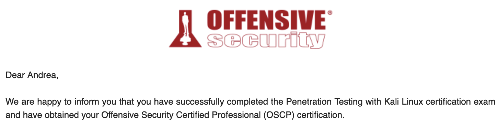
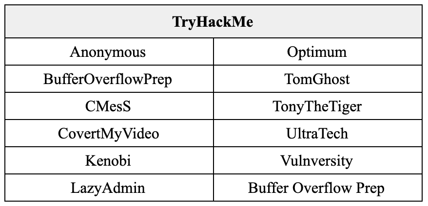
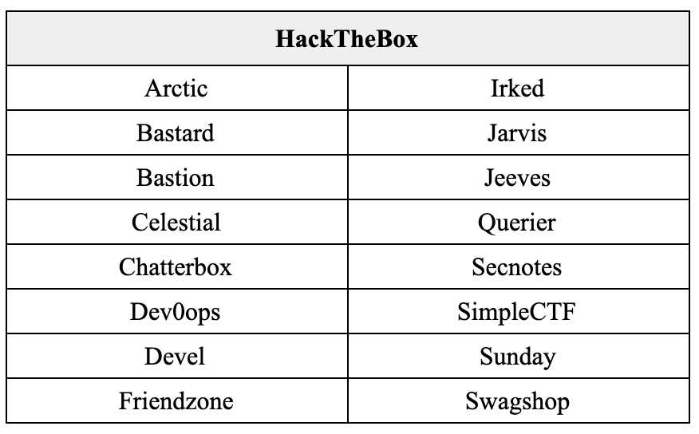
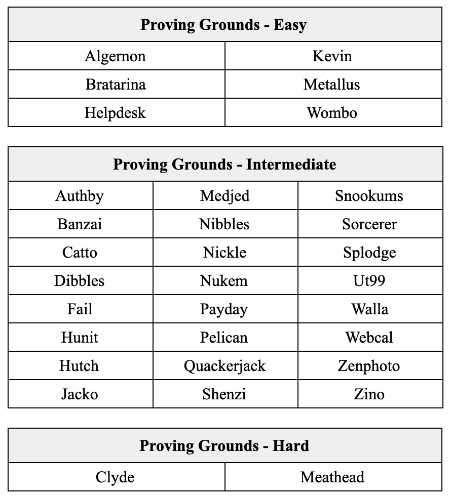

I have recently sat for the Offensive Security Certified Professional (OSCP) exam and passed in my first attempt with an estimated score of 77.5 points.

Since I have benefited from many OSCP reviews such as this, I thought it would be a good idea for me to share my experience of the entire journey. The questions I found to be helpful when I was just another PWK student in search for tips were:

- What did you do to prepare before starting on the course?
- How did you spend your lab time?
- What was your exam strategy?
- What tips do you have for us?
- What do you plan to do next?

At the risk of sounding just like every other post-exam review, here are my (very long) answers to that set of questions.

### 1. What tips do you have for us?

This question is out of sequence, but I thought it should be addressed first given its importance. Here's some practical tips that worked for me in no particular order:

- **Make your own cheat sheet**. It should be as concise as possible and only serves as a reference page for you to remember what you have done before at one glance. (E.g. privilege escalation via Potato requires XYZ command)

- **Plan your exam day properly**. Do not try a new brand of coffee on the day itself. Stick to your routine. If you are the type that gets productive at 11am, consider starting your exam at 9am instead. Odds are you'll be too worried to sleep well and would already be awake at 8am.

- **Proving Grounds is the best platform for exam preparation**. The community labelled easy and intermediate boxes are similar to those in the exam environment in terms of difficulty level. I suggest working on PG machines _only_ when you are already familiar with the methodology and are ready to do it without hints. I would factor in one month of PG practice before the exam date because it _**will**_ give you a reality check.

- **You are in a rabbit hole if you repeat the same steps again and again while expecting different results**. Try another attack vector.

- **Try different ports if you have issues escalating from RCE to interactive shell**. I found that using the same port as the service you are exploiting when generating a reverse shell generally works well. (E.g. if there is a web server available at :80, try using :80 as your reverse shell port)

- **Take regular breaks**. While it is not intuitive, I find it knowing when to "give up" on an attack vector to be helpful. Go take a nap and come back to it later. Who knows, that attack vector would make more sense with a fresh set of eyes.

- **If the exploit script doesn't work, DO IT MANUALLY**. I capitalized it for a reason. Go figure.

- **Prepare your report beforehand**. Have a template at hand to easily insert your documentation. This helps to bootstrap your report writing. 24 hours is not very long when you didn't sleep the entire day prior. No one wants to fail because of a terrible report right?!

- **If you finish early, use that time to work on your documentation**. Replicate your exploitation process, take better screenshots, write short explanations on why you used XYZ commands. This helps to check if you have missed out anything and shorten the time needed to work on your report. If you still have time, feel free to chase after the remaining points.

- **Document as you work on a box**. This should be part of your methodology. Make it a habit to take screenshots, paste commands and write short notes of what you did at your choice of note-taking platform. I suggest cloud-based applications like OneNote in the event of a catastrophic event.

- **Read the instructions at your control panel before you start**. Please.

#### Reliance on Hints vs "Try Harder" Mentality

Let's have a quick discussion over the use of hints. I believe this is a topic that many agonized over while working on difficult boxes. While preparing for my own exam, I across this interesting [perspective from u/FearfulFerret](https://www.reddit.com/r/oscp/comments/m29gx4/oscp_practical_advice_for_success/) over at _r/oscp_ as thought that I should share.

> _I decided it would be better to expose myself to as much material as possible in the time before the exam rather than beating my head against wall after wall; this worked well for me, but I think this is an area where everyone will be different. **Looking at hints prioritizes exposing you to as large a variety of enumeration and exploitation techniques as you can. Foregoing hints prioritizes your methodology and drive.** Work on whichever seems more meaningful to you._

Indeed, work on whichever seems more meaningful to you. Personally, I find little advantage in banging my head against the wall for long hours. To obtain that sweet spot between over-reliance and "trying harder" to the point of tears, I have a checklist to complete before throwing my hands up in defeat.

- Have I been stuck for X hours?
- Have I taken a short break?
- Have I checked everything in my checklist after said break?
- Am I lying to myself?

If the answer is yes for all except the last, I would proceed to take a peek at the hints or walkthrough. If I find that it was something obvious that I missed out on, I would update my checklist (in bold red if necessary) so that I won't miss it again. If I missed it because of a gap in knowledge, I would take some time to study the vulnerability and make sense of it. This way, I wouldn't feel as if I had cheated since I am improving upon my process / learning new skills in both options.

That said, we should still remember that there will be no guidance available when we are in the exam. Ultimately, as we learn and become much more confident in our methodology, we should strive to root boxes without hints.

### 2. What did you do to prepare before starting on the course?

As a student pursuing a degree in information security, obtaining OSCP has always been something I have aimed to achieve. Unfortunately, due to limited purchasing power, OSCP was an expensive endeavor which I was willing to pursue _only_ when I was decently prepared.

To get started on my journey towards OSCP, I first signed up at free platforms like TryHackMe and practiced on vulnerable machines there. This allowed me to get a feel of the methodology. Needless to say, I've referenced the walkthrough almost every step of the way.

Once familiarized, I subscribed to HackTheBox (HTB) and started working on boxes listed in **[TJNull's NetSecFocus Trophy Room](https://docs.google.com/spreadsheets/d/1dwSMIAPIam0PuRBkCiDI88pU3yzrqqHkDtBngUHNCw8/edit#gid=0).** After each HTB machine, I would **do a review by watching [Ippsec's](https://www.youtube.com/channel/UCa6eh7gCkpPo5XXUDfygQQA)** -- this helps me to identify alternative attack vectors and at times even understand underlying technology that made the attack possible.

I realized very soon that I had severe knowledge gaps when it comes to privilege escalation. To tackle this, I bought **[TCM Security Inc's](https://academy.tcm-sec.com/courses?query=privilege+escalation) Windows and Linux Privilege Escalation course** bundle. I chose this over the wildly recommended privilege escalation course by [Tib3rius](https://www.udemy.com/user/tib3rius/) largely because it was cheap(er) and featured hands-on labs for every escalation method taught. In hindsight, however, I should have just bought both. I still suck at privilege escalation.

Overall, I would categorize this period as "casual preparation" as they were done _extremely_ irregularly over the course of 2 years -- largely due to the lack of discipline, school, internship and general life commitments.

### 3. How did you spend your lab time?

Before we continue, let's set the stage for how much time I was able to dedicate to seriously prepare for this certification.

At the point of course registration in March 2021, I was in my last semester of university and had fairly light workload. This allowed me to dedicate 3 days a week for a full month. After which, I would have to stop cold turkey for nearly 2 weeks due to final examinations (gal gotta study and graduate) before being able to spend 24/7 on the subsequent month focusing solely on the certification. In total, I had about 3 months of serious preparation before my scheduled exam in June 2021.

#### Offensive Security Official Labs

I hit the ground running on the very first day of my 30 days lab time. I could only do this thanks to the preparation done prior to the registration of the course. While I did spend time reading the PDF from cover to cover, I elected to **forgo the lab practice**. This was decided through a simple cost-benefit analysis that takes into consideration my schooling commitments and limited lab time.

It's helpful to mention here that I have had **weekly study sessions** with folks from _Responsible Cyber_ -- my previous internship company -- who had also registered for the course. These study sessions kept me disciplined and also provided me with a sense of community. Studying alone is lonely after all.

By the end of my 30 days of lab time, I had rooted 20 boxes. The subsequent 2 weeks were then spent on studying for my final examinations.

#### TryHackMe Buffer Overflow Prep

Once school was done and dusted, I turned my focus back to OSCP.

I first dedicated a weekend into getting used to Buffer Overflow. Since it was a topic already covered at school, I didn't have much difficulty with it. The most useful resource I would recommend for this topic is **[TryHackMe's OSCP Buffer Overflow Prep](https://tryhackme.com/room/bufferoverflowprep)** room.

#### Offensive Security Proving Grounds

After seeing tons of raving reviews about **[Offensive Security’s Proving Grounds](https://www.offensive-security.com/labs/)**, I signed up for the practice subscription and promptly had my ass kicked by the easy and immediate boxes available. The difficulty level was so different from the course labs that I privately told my friends that _“I’ll be screwed if the difficulty level labeled on the boxes is an accurate reflection of the exam environment”._

While subsequent boxes were rooted with conscious efforts to avoid any forms of hints in order to simulate the exam environment, I am not ashamed to admit that I relied on walkthroughs for the first ~10 boxes. I’ve discussed a bit about the tradeoff of relying on hints vs the "trying harder" mentality above so I won’t elaborate upon it here.

All in all, I completed about 32 boxes from Proving Grounds within a month.

#### Summary of completed boxes

In total, I rooted **77** boxes with nearly ~50 over the course of 4 months. The full list of machines can be found at the last section.

- Offensive Security Official labs – 20
- Offensive Security Proving Grounds Practice – 32
- Hack the Box – 16
- TryHackMe – 10

### What was your exam strategy?

3 days before the exams, I stopped working on rooting any more boxes. The time was spent on resting and outlining a general strategy for the exam instead.

#### Strategy

In terms of tackling the boxes, I figured I would work on it in the following order:

1.  Finish buffer overflow (25 points) within 1 hour and run _autorecon_ on other machines in the meantime.
2.  Obtain 10 points (root) _OR_ 20 points (user) depending on which seems easier via preliminary scan results.
3.  Work on whatever that's left.

As you can see, I gave up planning by step 2 because there were just too many variables at hand. Other miscellaneous stuff includes:

- Taking 45mins breaks every 1.5hrs (with 30mins grace if I'm in the midst of something interesting).
- Having lunch and dinner at regular timing away from my workstation.
- Sleeping by 2am for at least 4 hours.

#### Reality

In the end, it went as expected; no plans ever survive contact with the enemy after all. Here's a rough breakdown on how my 24 hours went.

**T~3 (3hrs for 10 point and BOF -- including breaks + set up time)**

- Spent 30 mins working on setup issues. While it ate into my time, it killed most of my nervousness.
- Completed BOF within an hour. Made a mistake but was able to quickly recognize the moment I've veered off and managed to get back on track.
- Worked on 10 pointer next and was able to spot the vulnerability within a short amount of time. Obtained root within an hour.
- Took a 20min break.

**T~9 (6hrs for 20 pointer -- including breaks)**

- Got stuck at 20 pointer for 2.5hrs and was switching back and forth with another 20 pointer machine. No progress for both.
- Took a 1hr break.
- Obtained root for 20 pointer within 2hrs. I had overlooked a piece of information that I had previously wrote off as unimportant.
- Took a 30mins break.

**T~16 (7hrs for 25 pointer -- including breaks)**

- Obtained user shell for 25 pointer within 1.5hr.
- Took a 20mins break.
- Got stuck at privilege escalation for 1.5hr.
- Took another 30mins break.
- No progress on escalation for another hour.
- Took 1hr break to shower.
- Still stuck at escalation for another hour ☹️

**T~18.5 (2.5hrs for sleep)**

- Decided that it was time to sleep since _brain.exe_ has stalled. I'll let you know that I had actually dreamed about rooting the 25 pointer and was absolutely _crushed_ when I woke up 😢

**T~19.5 (1hr for 20 pointer)**

- Switched to work on another 20 pointer. I was able to climb out of the rabbit holes I was previously stuck in and obtained user within an hour. I have now obtained enough points to pass 🎉

**T~22.5 (3hrs to wrap up)**

- Took a short break and tried to privilege escalate for the 20 pointer to no avail -- I was too tired to really think. Instead of pressing on, I decided to replicate the exploitation process for all other boxes and work on documentation.

Once I had doubled, tripled and quadrupled checked that I had submitted the right proof keys for the right IP address and had all my screenshots with me, I thanked the proctor and ended the exam.

After a glorious 5 hours of sleep, I took my time to compile my report and uploaded it. 3 long days of constantly checking my email later, I have finally got the long awaited email!

I am now an OSCP!

### What do you plan to do next?

On top of my head, there’s a couple stuff I want to try out.

**Bug bounty** is one. I have tried my hand at it but realized that I need to up my game at my practical reconnaissance methodology before getting my hands dirty into the technical bits. One can’t hunt for exploits when one doesn’t even know what assets are available.

Certification wise, achieving **[Offensive Security Web Experience](https://www.offensive-security.com/awae-oswe/)** (OSWE) is certainly a target. Unfortunately, I have little development experience and zero knowledge on source code review. Since I prefer to be decently prepared before I shell out the amount of money OSWE requires, this will be on the back burner for a while.

Another certification that I’m considering is the **[Practical Network Penetration Tester](https://certifications.tcm-sec.com/)** (PNPT) certification from TCM Security, Inc. It’s fairly new, but I feel that it would be a natural progression from OSCP as the exam scope features Active Directory exploitation to compromise the exam Domain Controller. Definitely sounds like a challenge.

That said, I’ve actually just started a full time position and would need some time to get used to the work environment – I suppose I’ll get into these sometime in 2022. Meanwhile, I shall be content with keeping my skills sharp by rooting active HTB machines.

### Special thanks!

No success can be attained alone.

Some of my biggest motivators for this certification -- and cybersecurity in general -- are my bosses and mentors from the various startups I've interned in. They were the ones who introduced me into the world of penetration testing ([@horangi](https://www.horangi.com/)), helped me along with explaining sections of walkthrough when I'm stuck ([@ecobee](https://www.ecobee.com/)) and organized weekly study session to make sure I'm disciplined throughout the final months of preparing for the exam ([@responsiblecyber](https://responsible-cyber.com/)).

Not to forget my university friends who had helped and encouraged me throughout this journey. In particular to Jerome, who had the dubious honor of dealing with my frantic fretting and general exam anxiety. Thanks bruh. Honestly won’t be able to do it without y'all.

Last but not least, to **Woman on Cyber** ([@womenoncyber](https://twitter.com/womenoncyber)) for sponsoring my PWK course + exam voucher. Do [check them out](https://women-on-cyber.com/scholarship/) if you are based in Singapore!

### List of completed boxes

