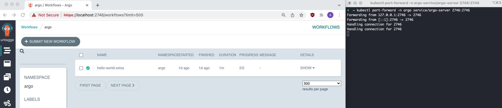

A how-to reference on installing Argo Workflow in your local environment because no, we are _not_ going to test workflow templates in a production environment.

<!--more-->

Being a deployment idiot who didn't even know what in the world Dockers were before diving into Argo Workflow, Kubernetes was a big wtf. This means that something as simple as installing Argo Workflow -- which admittedly has a very straightforward set of installation instructions -- took me some time. So here it is, an idiot proof guide to getting Argo Workflow up and running locally.

### Step 1: Start a local Kubernetes cluster with [Minikube](https://minikube.sigs.k8s.io/docs/start/)

```bash
# Assuming Docker has already been installed
brew install minikube
minikube start --driver=docker
```

### Step 2: Install Argo Workflow with `quick-start-minimal.yaml` manifest

```bash
# Create namespace where all Argo related settings will live in: argo
kubectl create namespace argo

# See https://github.com/argoproj/argo-workflows/tree/master/manifests
kubectl apply -n argo -f <QUICKSTART_MANIFEST_LINK.yaml>

# For Argo controller to have permission to run pods in default namespace
kubectl create rolebinding default-admin --clusterrole=admin --serviceaccount=default:default
```

### Step 3: Port-forward to access Argo UI service via `localhost`

```bash
# Find internal endpoint of Argo UI
kubectl get service -n argo
kubectl port-forward -n argo service/<SERVICE_NAME> 2746:2746
```

### Step 4: Ensure Docker containers can be reached by cluster

```bash
# Configure environment to use minikube's Docker daemon
eval $(minikube docker-env)
```

### Step 5: Create and deploy workflow template for container

```bash
# Build and tag docker container
docker build -t <CONTAINER_NAME> /path/to/dockerfile/directory
docker tag <CONTAINER_NAME>:latest <CONTAINER_NAME>:<TAG>

# Submit workflow template
argo submit -n argo --watch <WORKFLOW_TEMPLATE.yaml>
```

### Step 6: View deployed workflow via UI at `https://localhost:2746`


