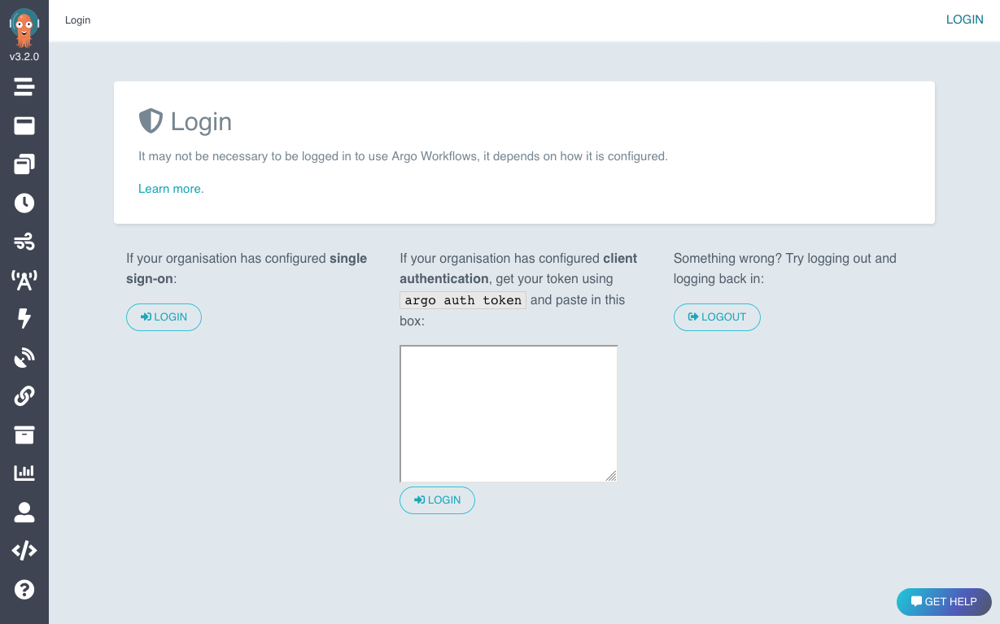

Getting Argo Workflow up and running is rather straightforward when you use their quick start manifests. Unfortunately, the same can't be said when it comes to installing it in a production-ready server.

<!--more-->

(Or maybe I'm just too noob 🥲)

This guide assumes that you are using `install.yaml` -- the standard argo cluster-wide installation -- as the manifest, and that `Helm` and `Kubernetes` are already pre-installed and ready to go. For more information on setting up Kubernetes, check [this post](../2021-09-10/prod-setup-kubernetes) out

### Step 1: Install Argo CLI

```bash
# From official Argo installation guide
curl -sLO https://github.com/argoproj/argo-workflows/releases/download/v3.1.13/argo-linux-amd64.gz
gunzip argo-linux-amd64.gz

# Unpack and move installed executable to appropriate directory
chmod +x argo-linux-amd64
mv ./argo-linux-amd64 /usr/local/bin/argo

# Check if Argo is successfully installed
argo version
```

### Step 2: Install Argo Workflow

```bash
# Create namespace where all Argo related settings will live in: argo
kubectl create namespace argo

# Apply manifest (DO NOT CHOOSE QUICK START MANIFESTS as they are not suitable for production environment)
kubectl apply -n argo -f https://raw.githubusercontent.com/argoproj/argo-workflows/master/manifests/install.yaml

# Grant admin access to default service account
kubectl create rolebinding default-admin --clusterrole=admin --serviceaccount=default:default
```

### Step 3: Expose Argo Workflow user interface through Nginx

```bash
# Find internal endpoint of Argo UI
kubectl get service -n argo

# Install nginx
apt update
apt install nginx

# Expose port [INTERNAL_SERVICE_IP]:2746
cd /etc/nginx/sites-available
vim argo
	server {
		listen 2746;
		server_name _;

		location / {
			proxy_pass https://[INTERNAL_SERVICE_IP]:2746;
		}
	}

# Create symlink of nginx configuration and reload to enable
ln -s /etc/nginx/sites-available/argo /etc/nginx/sites-enabled/argo
nginx -s reload
```

### Step 4: Obtain credentials for Argo UI

```bash
# Find token name with naming convention of argo-server-token-*
kubectl get secrets -n argo

# View token stored in argo-server-token
kubectl -n argo get secrets argo-server-token -o=jsonpath="{.data.token}" | base64 -d; echo
```

To view workflows within the browser, you should insert the base64-decoded token as `Bearer <JWT_TOKEN_VALUE>` into the input box at the UI dashboard.



### Step 5: Configure Argo artifact repository

```bash
# Assuming that helm is already pre-installed
# Install MinIO in a new namespace: argo-minio
helm install argo-artifacts minio/minio --set service.type=ClusterIP --set fullnameOverride=argo-artifacts --namespace argo-minio

# Obtain credentials for Minio UI
kubectl -n argo-minio get secret argo-artifacts -o jsonpath='{.data.accesskey}' | base64 --decode; echo
kubectl -n argo-minio get secret argo-artifacts -o jsonpath='{.data.secretkey}' | base64 --decode; echo

# Populate credentials obtained into environment file
vim .argo-minio-cred.env
	accessKey=<accesskey_value>
	secretKey=<secretkey_value>

# Create secrets based on credentials stored in environment file
kubectl create secret generic argo-minio-cred -n argo --from-env-file=./.argo-minio-cred.env -o yaml
kubectl get secret -n argo argo-minio-cred -o yaml > argo-minio-cred.yaml

# Ensure kubernetes knows where the artifacts repository is
# This assumes that bucket named argo-artifacts has already been / will be created
# Service discovery format: <service-name>.<namespace-of-service>.svc.cluster.local
# Port number obtained via: kubectl get services -n argo-minio
vim argo-minio-config.yaml
	apiVersion: v1
	kind: ConfigMap
	metadata:
	  name: artifact-repositories
	  annotations:
		workflows.argoproj.io/default-artifact-repository: default-v1
	data:
	  default-v1: |
		s3:
		  bucket: argo-artifacts
		  # obtained via service discovery
		  endpoint: argo-artifacts.argo-minio.svc.cluster.local:9000
		  insecure: true
		  accessKeySecret:
			name: argo-minio-cred
			key: accessKey
		  secretKeySecret:
			name: argo-minio-cred
			key: secretKey

# Apply configuration and give argo service account admin role to enable communication with argo-minio namespace
kubectl apply -f argo-minio-config.yaml -n argo
kubectl -n argo create rolebinding default-admin --clusterrole=admin --serviceaccount=argo:default
kubectl -n argo get configmap artifact-repositories -o yaml
```

### Step 6: Create `argo-artifacts` bucket in MinIO and expose user interface through Nginx

```bash
# Create bucket named argo-artifacts via yaml (or you can use the UI)
vim minio-create-bucket.yaml
	apiVersion: v1
	kind: PersistentVolume
	metadata:
	  name: argo-artifacts
	spec:
	  capacity:
		storage: 500Gi
	  accessModes:
		- ReadWriteOnce
	  hostPath:
		path: "/data/argo-artifacts"

kubectl apply -f minio-create-bucket.yaml -n argo-minio

# Find the internal IP address of MinIO UI
kubectl get service argo-artifacts -n argo-minio

# Expose MinIO UI via nginx
cd /etc/nginx/sites-available
vim minio
	server {
		listen 9000;
		server_name _;

		location / {
			proxy_pass http://[INTERAL_SERVICE_IP]:9000;
		}
	}

# Create symlink of nginx configuration and reload to enable
ln -s /etc/nginx/sites-available/minio /etc/nginx/sites-enabled/minio
nginx -s reload
```

### Step 7: Run workflow and see them in action 🎉

```bash
# Create simple workflow for Argo
vim hello-world.yaml
	apiVersion: argoproj.io/v1alpha1
	kind: Workflow
	metadata:
	generateName: hello-world-
	spec:
	entrypoint: whalesay
	templates:
		- name: whalesay
		container:
			image: docker/whalesay
			command: [cowsay]
			args: ["hello world"]

# Submit workflow via Argo CLI
argo -n argo submit hello-world.yaml --watch
```
