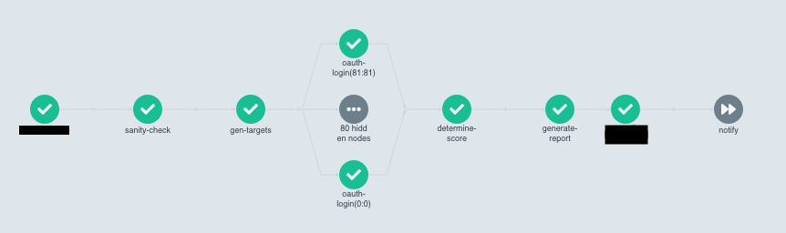

AKA how automation can help identify vulnerable endpoints at scale 🚀

<!--more-->

For a security blog, it must have been weird seeing a bunch of DevOps related guides that I have been posting periodically over the past year.

Well, that is because I have been trying my hands at automating security operations at scale. Emphasis on "trying" and "at scale" portions, because, to be very honest, I have never done anything more than simple web applications for personal use or hastily cobbled scripts -- I am _not_ a software engineer for a reason.

Anyway.

## The Why(s)

One thing I noticed while hunting for bugs is that there are heck lots of companies that use Google OAuth as their primary set of first-layer authorization controls. This model makes sense for companies that has tons of subsidiaries (each with different domains) under their umbrella. Unfortunately, due to the sheer amount of domain prefixes they have to cater to, the regex expression used to ensure login-able email addresses are scoped to company-owned domains are weak.

The process of checking if endpoints are vulnerable to this bug is fairly straight-forward:

- Check if the endpoint allows login via Google OAuth
- Check if endpoint allows login via tampered accounts like `@company.com.attacker.com`
- Check if endpoint allows tampered accounts to view data

This is certainly simple when you only have one endpoint, but what happens when you have >1000 to check against? Or god-forbid, if you have to do the same set of checks on a regular basis?

Yikes.

Now that we have established _why_ there was a need for automation at scale, sit tight for a 2-part series on how I embraced automation to identify vulnerable endpoints and eventually escalated from a simple authentication bypass bug (low impact) to obtaining PIIs (high impact).

## The How(s)

When I first started working on the prototype, I thought it could be finished within a month since there are tons of tutorials out there that teaches one to login programmatically.

I wish. LOL.

To be fair, it _is_ simple -- if you were automating the login process for <50 endpoints, that is. Things became dicey as soon as I started planning ahead for scaling. These were some of the burning questions I had to scramble for a solution:

1. How do I identify the endpoints that are utilizing Google as their primary mode of authentication? I also have to also take into account redirects (immediate, button-based, popup-based) carried out by the endpoint to forward users to the OAuth login page. What if the target has company-specific middleware authentication layers?

2. How do I deal with Google's login challenges? Since the OAuth login process is not meant to be automated, I would definitely hit some form of bot-prevention measures deployed by Google to deter automated logins. Should I try to find a way to programmatically solve the CAPTCHAs? Or better yet, can I avoid triggering them in the first place?

3. How do I identify endpoints that are vulnerable to this bug? In fact, what would it take to categorize the endpoint as "vulnerable"? When the tool successfully login into the endpoint? Or is it only considered as such when impact-worthy data are being returned?

4. How do I automate this process in a way that scales -- especially for targets with >1000 endpoints -- and more importantly, doing it in a way that will not trigger alarm from the targets?

So yep, it was a big headache indeed.

#1 and #3 wasn't much of an issue in terms of logic and algorithm. They took some time, yes, but that was mostly because I am a _terrible_ software engineer (data structures and algorithms are absolutely NOT my cup of tea).

For the former, just about any headless browser would work, and I decided to go with Google's Puppeteer simply because I have had prior experience scraping websites with it. For the latter, I came up with a very rudimentary "scoring" system where more points are awarded to endpoints that had the relevant HTTP requests and/or responses as seen in the [OAuth 2.0 grant-type specifications](https://portswigger.net/web-security/oauth/grant-types). It's not foolproof, but that will be something to improve on for `v2.0.0`.

The hardest part, in my opinion, was #2 and #4.

Given that the tool is heavily intertwined with its ability to resolve login challenges or outright bypass them, it was extremely pressing for me to produce a consistent solution with regards to Google's bot prevention system. If not, well, this blog post wouldn't exist. For #4, I'll be honest, it was _painful_. I had absolutely no idea what I was doing half of the time; I mean, come on, I knew nothing about deployment before this, much less about scaling.

While I am not about to disclose my secret sauce for dealing with #2 (hint: 💸💸💸), I ended up using a combination of tools to help spread out and speed up the checks for authentication bypass:

- NPM library [puppeteer-cluster](https://github.com/thomasdondorf/puppeteer-cluster) to run multiple instances of Puppeteer in parallel
- [Kubernetes](https://kubernetes.io/) & [Argo Workflow](https://argoproj.github.io/argo-workflows/) to run multiple pods of the dockerized tool across multiple nodes in parallel

Here's a peek into how the entire pipeline looks like!

## The Result(s)

Although I am rather worried if it's "sneaky" enough, I think the tool worked pretty well all things considered. It was able to **scan nearly 80K endpoints under 4 hours** and netted me entry to **~10 admin portal endpoints** with varying degrees of viewable data. For someone who had never delivered a non-school related product, I am quite proud of how `v1.0.0` turned out. Of course, as a bug bounty hunter, I would have preferred to net more "hits", but it's certainly better than nothing!

In the next installation of this series, I will be sharing how I was able to escalate from this authentication bypass bug to obtaining PIIs for one of the juicy endpoints.

See you there!
